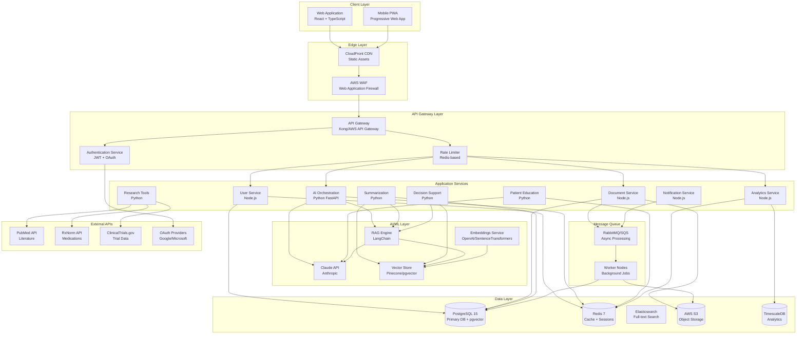
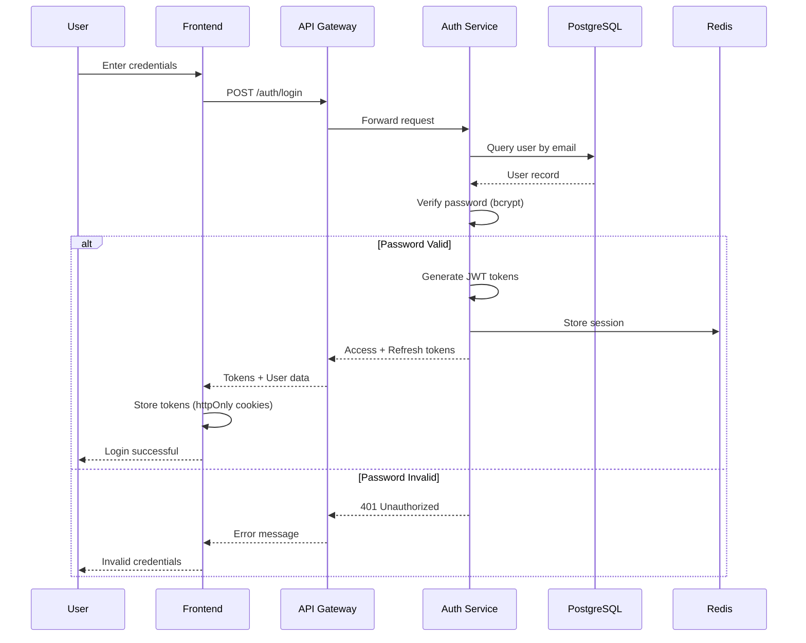
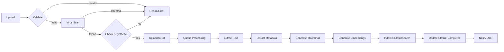
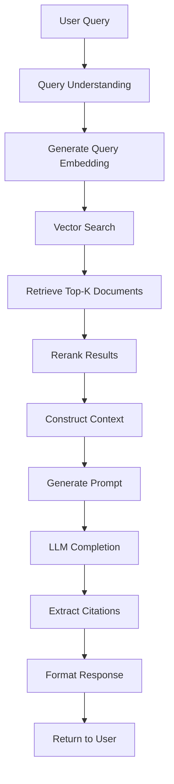
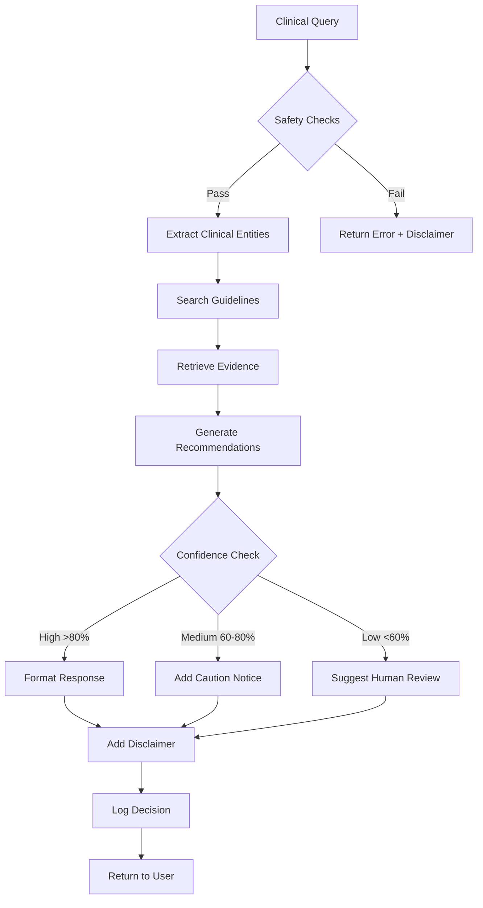
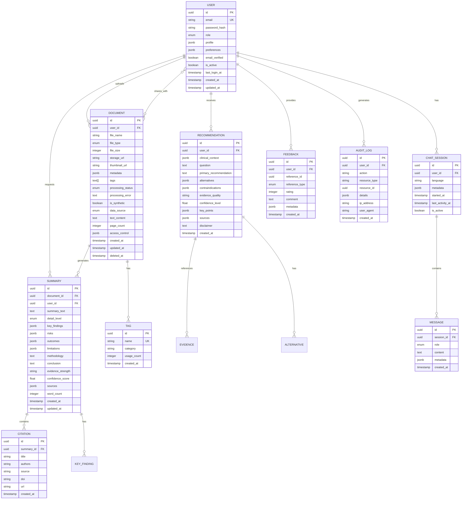
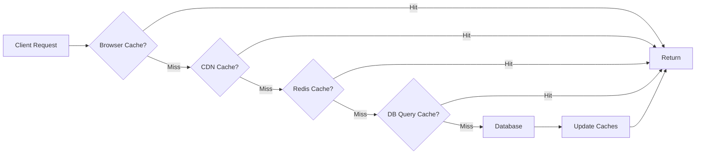
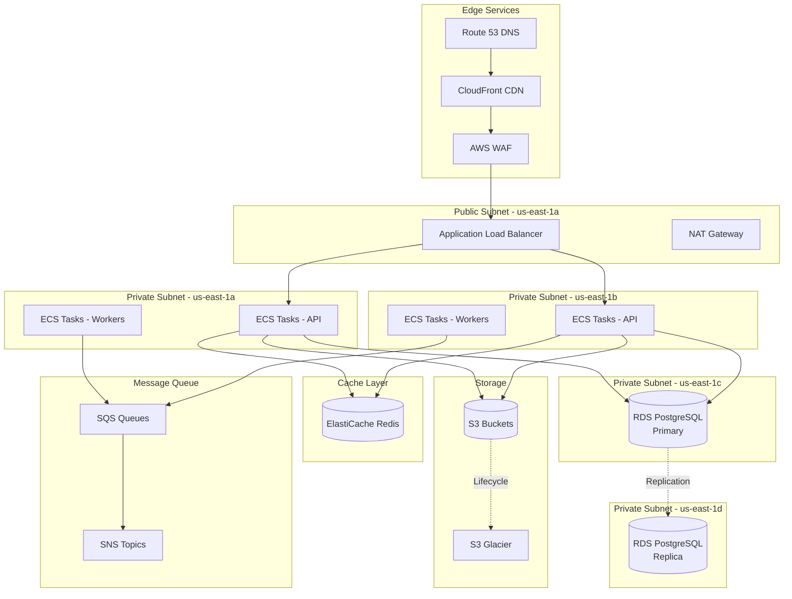

# System Design Document
# AI Healthcare Support System

---

## Document Information

| Field | Value |
|-------|-------|
| **Document Title** | System Design Document - AI Healthcare Support System |
| **Version** | 1.0 |
| **Date** | February 15, 2026 |
| **Status** | Draft |
| **Prepared By** | Healthcare AI Development Team |
| **Last Updated** | February 15, 2026 |
| **Classification** | Internal Use |

---

## Table of Contents

1. [Executive Summary](#1-executive-summary)
2. [Design Principles](#2-design-principles)
3. [System Architecture](#3-system-architecture)
4. [Detailed Component Design](#4-detailed-component-design)
5. [Database Design](#5-database-design)
6. [API Design](#6-api-design)
7. [Security Design](#7-security-design)
8. [Scalability & Performance](#8-scalability--performance)
9. [User Interface Design](#9-user-interface-design)
10. [Deployment Architecture](#10-deployment-architecture)
11. [Monitoring & Observability](#11-monitoring--observability)
12. [Disaster Recovery](#12-disaster-recovery)
13. [Testing Strategy](#13-testing-strategy)
14. [Cost Estimation](#14-cost-estimation)
15. [Migration & Rollout Strategy](#15-migration--rollout-strategy)
16. [Future Enhancements](#16-future-enhancements)
17. [Appendices](#17-appendices)

---

## 1. Executive Summary

### 1.1 Overview

The AI Healthcare Support System is a comprehensive, cloud-based platform designed to improve efficiency, understanding, and support within healthcare and life-sciences ecosystems. The system leverages advanced AI/LLM technology to provide clinical and research information summarization, workflow automation, patient education, and decision-support capabilities.

**Key Objectives:**
- Reduce clinician documentation time by 40-60%
- Accelerate research literature review by 60%+
- Improve patient understanding of medical information by 80%+
- Ensure 100% compliance with synthetic data requirements
- Maintain 99.5%+ system uptime

### 1.2 Key Architectural Decisions

| Decision Area | Choice | Rationale |
|--------------|--------|-----------|
| **Architecture Pattern** | Microservices | Scalability, maintainability, independent deployment |
| **Frontend Framework** | React 18 + TypeScript | Rich ecosystem, type safety, performance |
| **Backend Framework** | Node.js (NestJS) + Python (FastAPI) | Node for API gateway, Python for AI/ML services |
| **Primary Database** | PostgreSQL 15+ with pgvector | ACID compliance, vector search capabilities |
| **Cache Layer** | Redis 7+ | High performance, pub/sub support |
| **LLM Provider** | Anthropic Claude API | Superior reasoning, safety features |
| **Cloud Provider** | AWS | Comprehensive services, HIPAA-ready infrastructure |
| **Container Orchestration** | Kubernetes (EKS) | Industry standard, auto-scaling, resilience |

### 1.3 Technology Stack Summary

**Frontend Stack:**
- React 18, TypeScript, Tailwind CSS, shadcn/ui, React Query, Zustand

**Backend Stack:**
- Node.js 20 (NestJS), Python 3.11 (FastAPI), JWT authentication, GraphQL

**AI/ML Stack:**
- Anthropic Claude API, LangChain, pgvector, Pinecone, Sentence Transformers

**Data Stack:**
- PostgreSQL, Redis, Elasticsearch, TimescaleDB, AWS S3

**Infrastructure:**
- AWS (EKS, RDS, ElastiCache, S3, CloudFront), Docker, Terraform, GitHub Actions

### 1.4 Design Highlights

1. **Multi-tier architecture** with clear separation of concerns
2. **RAG (Retrieval-Augmented Generation)** for accurate, source-grounded responses
3. **Role-based access control** supporting 4 distinct user roles
4. **Synthetic-data-only enforcement** with validation at every layer
5. **Comprehensive safety framework** with disclaimers, confidence scores, and human-in-the-loop
6. **Event-driven processing** for async operations
7. **WCAG 2.1 AA compliant** interfaces
8. **Zero-trust security model** with encryption at rest and in transit

---

## 2. Design Principles

### 2.1 Core Design Principles

#### 1. **Security by Design**
- **Implementation:**
  - Encryption at rest (AES-256) and in transit (TLS 1.3)
  - Role-based access control (RBAC) with least privilege
  - Comprehensive audit logging for all sensitive operations
  - Regular security scanning and penetration testing
  - Secrets management with AWS Secrets Manager
  - Zero-trust network architecture

#### 2. **Modular Architecture**
- **Implementation:**
  - Microservices with well-defined boundaries
  - Loose coupling through event-driven communication
  - High cohesion within services
  - Independent deployment and scaling
  - Shared-nothing architecture for data
  - API-first design approach

#### 3. **Scalability First**
- **Implementation:**
  - Horizontal scaling for all services
  - Stateless application design
  - Database read replicas for query distribution
  - Caching at multiple layers (CDN, application, database)
  - Async processing for heavy workloads
  - Auto-scaling based on metrics

#### 4. **User-Centric Design**
- **Implementation:**
  - Accessibility compliance (WCAG 2.1 AA)
  - Responsive design for all devices
  - Intuitive navigation with max 3 clicks to features
  - Progressive disclosure of complexity
  - Contextual help and onboarding
  - Multiple language support

#### 5. **Transparency & Explainability**
- **Implementation:**
  - Display AI reasoning and confidence scores
  - Source attribution for all AI-generated content
  - Clear limitation statements
  - Model version tracking
  - Decision audit trails
  - User-friendly explanations of AI outputs

#### 6. **Fail-Safe Mechanisms**
- **Implementation:**
  - Graceful degradation when services unavailable
  - Circuit breakers for external API calls
  - Retry logic with exponential backoff
  - Human oversight triggers for low-confidence outputs
  - Comprehensive error handling and user feedback
  - Fallback mechanisms for critical paths

#### 7. **Data Minimization & Privacy**
- **Implementation:**
  - Synthetic data only, no PHI/PII
  - Validation of data sources at ingestion
  - Data retention policies with automatic cleanup
  - User consent management
  - Privacy by design principles
  - Anonymization where applicable

#### 8. **Performance Optimization**
- **Implementation:**
  - Sub-2-second page load times
  - Response caching (CDN, Redis)
  - Lazy loading and code splitting
  - Database query optimization
  - Async processing for long-running tasks
  - Connection pooling and resource management

#### 9. **Maintainability**
- **Implementation:**
  - Clean code principles (SOLID, DRY)
  - Comprehensive documentation (code, API, architecture)
  - Automated testing (80%+ coverage)
  - Centralized logging and monitoring
  - Version control with Git
  - CI/CD pipelines

#### 10. **Compliance-Ready**
- **Implementation:**
  - HIPAA-aware architecture (no PHI in MVP)
  - GDPR principles (data minimization, right to deletion)
  - FDA guidance for clinical decision support
  - Audit trails for regulatory requirements
  - Data governance framework
  - Ethics review integration points

---

## 3. System Architecture

### 3.1 High-Level Architecture



### 3.2 Architecture Patterns

#### 3.2.1 Microservices Architecture
- **Service Decomposition:** Based on business capabilities (User, Document, AI, etc.)
- **Communication:** REST APIs for synchronous, Message Queue for async
- **Data Management:** Each service owns its data (database per service pattern)
- **Service Discovery:** Kubernetes service discovery
- **Load Balancing:** Kubernetes ingress with ALB

#### 3.2.2 Event-Driven Architecture
- **Event Bus:** RabbitMQ or AWS SQS/SNS
- **Event Types:**
  - Document Uploaded
  - Summary Requested
  - User Registered
  - Analysis Completed
  - Notification Required
- **Event Sourcing:** For audit trail and analytics
- **CQRS:** Separate read/write models for analytics

#### 3.2.3 API Gateway Pattern
- **Responsibilities:**
  - Request routing
  - Authentication/authorization
  - Rate limiting
  - Request/response transformation
  - API versioning
  - Monitoring and logging

#### 3.2.4 Repository Pattern
- **Purpose:** Abstract data access logic
- **Benefits:** 
  - Testability (mock repositories)
  - Consistency in data access
  - Single source of truth for queries
  - Easy to switch data sources

#### 3.2.5 Circuit Breaker Pattern
- **Implementation:** For all external API calls (Claude, PubMed, etc.)
- **States:** Closed → Open → Half-Open
- **Thresholds:**
  - Failure rate: 50% in 30 seconds
  - Open duration: 60 seconds
  - Half-open test calls: 5
- **Fallback:** Cached responses or error messages

#### 3.2.6 Retry Pattern
- **Strategy:** Exponential backoff with jitter
- **Configuration:**
  - Max retries: 3
  - Initial delay: 1 second
  - Backoff multiplier: 2
  - Max delay: 30 seconds
- **Idempotency:** Required for all retryable operations

### 3.3 Service Mesh Considerations

**For Production Scale (Future):**
- **Tool:** Istio or AWS App Mesh
- **Benefits:**
  - Service-to-service encryption (mTLS)
  - Advanced traffic management
  - Observability (distributed tracing)
  - Resilience patterns (timeouts, retries)

**Current MVP Approach:**
- Service mesh optional for MVP
- Implement at application level initially
- Plan for future migration

---

## 4. Detailed Component Design

### 4.1 Authentication & User Service

#### 4.1.1 Purpose
Handle user authentication, authorization, profile management, and role-based access control.

#### 4.1.2 Technology Stack
- **Framework:** NestJS (Node.js)
- **Authentication:** Passport.js with JWT strategy
- **Password Hashing:** bcrypt (cost factor 12)
- **OAuth:** Passport Google/Microsoft OAuth strategies
- **Session Store:** Redis

#### 4.1.3 API Endpoints

```typescript
// Authentication Endpoints
POST   /api/v1/auth/register
POST   /api/v1/auth/login
POST   /api/v1/auth/logout
POST   /api/v1/auth/refresh
POST   /api/v1/auth/forgot-password
POST   /api/v1/auth/reset-password
POST   /api/v1/auth/verify-email
POST   /api/v1/auth/oauth/google
POST   /api/v1/auth/oauth/microsoft

// User Management Endpoints
GET    /api/v1/users/me
PUT    /api/v1/users/me
DELETE /api/v1/users/me
GET    /api/v1/users/:id (admin only)
PUT    /api/v1/users/:id (admin only)
DELETE /api/v1/users/:id (admin only)
GET    /api/v1/users (admin only, paginated)
GET    /api/v1/users/:id/audit-log
PUT    /api/v1/users/:id/role (admin only)
PUT    /api/v1/users/:id/status (admin only)
```

#### 4.1.4 Data Models

```typescript
// User Entity
interface User {
  id: string;                    // UUID
  email: string;                 // Unique, validated
  passwordHash?: string;         // Optional for OAuth users
  role: UserRole;
  profile: UserProfile;
  preferences: UserPreferences;
  emailVerified: boolean;
  isActive: boolean;
  lastLoginAt?: Date;
  createdAt: Date;
  updatedAt: Date;
}

enum UserRole {
  ADMIN = 'admin',
  CLINICIAN = 'clinician',
  RESEARCHER = 'researcher',
  PATIENT = 'patient'
}

interface UserProfile {
  firstName: string;
  lastName: string;
  specialty?: string;           // For clinicians
  organization?: string;        // For clinicians/researchers
  licenseNumber?: string;       // For clinicians
  researchArea?: string;        // For researchers
  dateOfBirth?: Date;           // For patients
  avatar?: string;              // S3 URL
}

interface UserPreferences {
  language: string;             // ISO 639-1 code
  theme: 'light' | 'dark' | 'auto';
  timezone: string;             // IANA timezone
  notifications: {
    email: boolean;
    push: boolean;
    sms: boolean;
  };
  accessibility: {
    fontSize: 'small' | 'medium' | 'large';
    highContrast: boolean;
    screenReader: boolean;
  };
}

// JWT Token Payload
interface JWTPayload {
  sub: string;                  // User ID
  email: string;
  role: UserRole;
  iat: number;                  // Issued at
  exp: number;                  // Expiration
  type: 'access' | 'refresh';
}

// Session Store (Redis)
interface Session {
  userId: string;
  accessToken: string;
  refreshToken: string;
  expiresAt: Date;
  ipAddress: string;
  userAgent: string;
  lastActivity: Date;
}
```

#### 4.1.5 Authentication Flow



#### 4.1.6 Role-Based Access Control (RBAC)

```typescript
// Permission definitions
const PERMISSIONS = {
  // Document permissions
  'documents:create': ['admin', 'clinician', 'researcher'],
  'documents:read': ['admin', 'clinician', 'researcher', 'patient'],
  'documents:update': ['admin', 'clinician', 'researcher'],
  'documents:delete': ['admin', 'clinician', 'researcher'],
  
  // Summary permissions
  'summaries:create': ['admin', 'clinician', 'researcher'],
  'summaries:read': ['admin', 'clinician', 'researcher', 'patient'],
  
  // Decision support permissions
  'decisions:create': ['admin', 'clinician'],
  'decisions:read': ['admin', 'clinician'],
  
  // Research permissions
  'research:create': ['admin', 'researcher'],
  'research:read': ['admin', 'researcher', 'clinician'],
  
  // Patient education permissions
  'education:read': ['admin', 'clinician', 'patient'],
  'chat:create': ['admin', 'patient'],
  
  // Admin permissions
  'users:manage': ['admin'],
  'system:configure': ['admin'],
  'analytics:view': ['admin'],
};

// Authorization middleware
@Injectable()
export class PermissionGuard implements CanActivate {
  canActivate(context: ExecutionContext): boolean {
    const request = context.switchToHttp().getRequest();
    const user = request.user;
    const requiredPermission = this.reflector.get<string>(
      'permission',
      context.getHandler()
    );
    
    return this.hasPermission(user.role, requiredPermission);
  }
  
  private hasPermission(role: UserRole, permission: string): boolean {
    return PERMISSIONS[permission]?.includes(role) ?? false;
  }
}

// Usage in controllers
@Controller('documents')
export class DocumentController {
  @Post()
  @RequirePermission('documents:create')
  async createDocument(@Body() dto: CreateDocumentDto) {
    // Implementation
  }
}
```

#### 4.1.7 Security Measures

1. **Password Policy:**
   - Minimum 12 characters
   - Must include uppercase, lowercase, number, special character
   - No common passwords (check against breach database)
   - Password history (prevent reuse of last 5 passwords)

2. **Rate Limiting:**
   - Login attempts: 5 per 15 minutes per IP
   - Password reset: 3 per hour per email
   - Registration: 10 per hour per IP

3. **Token Security:**
   - Access token: 15 minutes expiry
   - Refresh token: 7 days expiry
   - Rotate refresh tokens on use
   - Blacklist tokens on logout
   - Store in httpOnly, secure cookies

4. **Session Management:**
   - Concurrent session limit: 5 per user
   - Idle timeout: 30 minutes
   - Absolute timeout: 12 hours
   - Device tracking and session revocation

5. **Multi-Factor Authentication (Future):**
   - TOTP (Time-based OTP) support
   - SMS backup codes
   - Email verification codes

---

### 4.2 Document Service

#### 4.2.1 Purpose
Handle document upload, validation, storage, processing, metadata extraction, and retrieval.

#### 4.2.2 Technology Stack
- **Framework:** NestJS
- **File Processing:** 
  - PDF: pdf-parse, pdfjs-dist
  - DOCX: mammoth
  - CSV: papaparse
  - Images: sharp
- **Virus Scanning:** ClamAV
- **OCR:** Tesseract.js (for scanned PDFs)
- **Storage:** AWS S3
- **Search:** Elasticsearch

#### 4.2.3 API Endpoints

```typescript
POST   /api/v1/documents/upload
GET    /api/v1/documents/:id
PUT    /api/v1/documents/:id
DELETE /api/v1/documents/:id
GET    /api/v1/documents (paginated, filtered)
POST   /api/v1/documents/:id/tags
DELETE /api/v1/documents/:id/tags/:tagId
GET    /api/v1/documents/search
POST   /api/v1/documents/:id/process
GET    /api/v1/documents/:id/download
POST   /api/v1/documents/:id/share
GET    /api/v1/documents/stats
```

#### 4.2.4 Data Models

```typescript
interface Document {
  id: string;
  userId: string;               // Owner
  fileName: string;
  fileType: DocumentType;
  fileSize: number;             // In bytes
  mimeType: string;
  storageUrl: string;           // S3 URL
  thumbnailUrl?: string;        // For PDFs/images
  
  metadata: DocumentMetadata;
  tags: string[];
  
  processingStatus: ProcessingStatus;
  processingError?: string;
  
  isSynthetic: boolean;         // CRITICAL: Must be true
  dataSource?: DataSource;      // WHO, PubMed, CDC, etc.
  
  textContent?: string;         // Extracted text
  pageCount?: number;
  
  accessControl: {
    isPublic: boolean;
    sharedWith: string[];       // User IDs
  };
  
  createdAt: Date;
  updatedAt: Date;
  deletedAt?: Date;             // Soft delete
}

enum DocumentType {
  PDF = 'pdf',
  DOCX = 'docx',
  CSV = 'csv',
  JSON = 'json',
  TXT = 'txt',
  IMAGE = 'image'
}

enum ProcessingStatus {
  PENDING = 'pending',
  PROCESSING = 'processing',
  COMPLETED = 'completed',
  FAILED = 'failed'
}

interface DocumentMetadata {
  title?: string;
  authors?: string[];
  publicationDate?: Date;
  journal?: string;
  doi?: string;
  pmid?: string;               // PubMed ID
  abstract?: string;
  keywords?: string[];
  studyType?: string;
  language?: string;
  
  // Clinical metadata
  patientId?: string;          // Synthetic only
  encounterDate?: Date;
  documentType?: string;       // Lab, Radiology, Note, etc.
  
  // Research metadata
  citations?: number;
  impact?: number;
  fundingSource?: string;
}

enum DataSource {
  WHO = 'who',
  PUBMED = 'pubmed',
  CDC = 'cdc',
  FDA = 'fda',
  CLINICALTRIALS = 'clinicaltrials',
  SYNTHETIC_GENERATOR = 'synthetic',
  USER_UPLOADED = 'user_uploaded'
}
```

#### 4.2.5 Document Processing Pipeline



#### 4.2.6 Upload Validation

```typescript
class DocumentValidator {
  private readonly MAX_FILE_SIZE = 50 * 1024 * 1024; // 50MB
  private readonly ALLOWED_TYPES = ['pdf', 'docx', 'csv', 'json', 'txt', 'png', 'jpg'];
  
  async validate(file: Express.Multer.File, metadata: DocumentMetadata): Promise<ValidationResult> {
    const errors: string[] = [];
    
    // File size check
    if (file.size > this.MAX_FILE_SIZE) {
      errors.push(`File size exceeds ${this.MAX_FILE_SIZE / 1024 / 1024}MB limit`);
    }
    
    // File type check
    const extension = file.originalname.split('.').pop()?.toLowerCase();
    if (!extension || !this.ALLOWED_TYPES.includes(extension)) {
      errors.push(`File type .${extension} not supported`);
    }
    
    // MIME type verification
    const expectedMimeType = this.getMimeType(extension);
    if (file.mimetype !== expectedMimeType) {
      errors.push('File MIME type does not match extension');
    }
    
    // CRITICAL: Synthetic data validation
    if (!metadata.isSynthetic) {
      errors.push('Only synthetic or public data is allowed');
    }
    
    // Data source validation
    if (!metadata.dataSource) {
      errors.push('Data source must be specified');
    }
    
    // Malware scan
    const scanResult = await this.scanForMalware(file.buffer);
    if (scanResult.isInfected) {
      errors.push('File failed security scan');
    }
    
    return {
      isValid: errors.length === 0,
      errors
    };
  }
  
  private async scanForMalware(buffer: Buffer): Promise<{ isInfected: boolean }> {
    // ClamAV integration
    // For MVP, can use basic signature checking
    return { isInfected: false };
  }
}
```

#### 4.2.7 Text Extraction Service

```typescript
@Injectable()
export class TextExtractionService {
  async extractText(document: Document): Promise<string> {
    const fileBuffer = await this.downloadFromS3(document.storageUrl);
    
    switch (document.fileType) {
      case DocumentType.PDF:
        return await this.extractFromPDF(fileBuffer);
      
      case DocumentType.DOCX:
        return await this.extractFromDOCX(fileBuffer);
      
      case DocumentType.TXT:
        return fileBuffer.toString('utf-8');
      
      case DocumentType.CSV:
        return await this.extractFromCSV(fileBuffer);
      
      default:
        throw new Error(`Unsupported file type: ${document.fileType}`);
    }
  }
  
  private async extractFromPDF(buffer: Buffer): Promise<string> {
    const pdfData = await pdf(buffer);
    
    // If text extraction yields little content, attempt OCR
    if (pdfData.text.length < 100) {
      return await this.performOCR(buffer);
    }
    
    return pdfData.text;
  }
  
  private async extractFromDOCX(buffer: Buffer): Promise<string> {
    const result = await mammoth.extractRawText({ buffer });
    return result.value;
  }
  
  private async performOCR(buffer: Buffer): Promise<string> {
    // Tesseract.js for OCR on scanned PDFs
    // Implementation details
    return '';
  }
}
```

#### 4.2.8 Metadata Extraction

```typescript
@Injectable()
export class MetadataExtractionService {
  async extractMetadata(document: Document, textContent: string): Promise<DocumentMetadata> {
    const metadata: Partial<DocumentMetadata> = {};
    
    // For research papers
    if (this.isResearchPaper(textContent)) {
      metadata.title = this.extractTitle(textContent);
      metadata.authors = this.extractAuthors(textContent);
      metadata.abstract = this.extractAbstract(textContent);
      metadata.doi = this.extractDOI(textContent);
      metadata.keywords = this.extractKeywords(textContent);
    }
    
    // For clinical documents
    if (this.isClinicalDocument(document.tags)) {
      metadata.patientId = this.extractPatientId(textContent);
      metadata.encounterDate = this.extractDate(textContent);
      metadata.documentType = this.classifyDocumentType(textContent);
    }
    
    // Language detection
    metadata.language = await this.detectLanguage(textContent);
    
    return metadata as DocumentMetadata;
  }
  
  private extractDOI(text: string): string | undefined {
    const doiRegex = /10\.\d{4,9}\/[-._;()\/:A-Z0-9]+/i;
    const match = text.match(doiRegex);
    return match ? match[0] : undefined;
  }
  
  private async detectLanguage(text: string): Promise<string> {
    // Use language detection library (e.g., franc)
    // Implementation
    return 'en';
  }
}
```

---

### 4.3 AI Orchestration Service

#### 4.3.1 Purpose
Central service for managing AI/LLM interactions, prompt engineering, response caching, and safety checks.

#### 4.3.2 Technology Stack
- **Framework:** Python FastAPI
- **LLM Client:** Anthropic Python SDK
- **Prompt Management:** LangChain
- **Caching:** Redis
- **Embeddings:** OpenAI Embeddings API / Sentence Transformers
- **Vector Search:** Pinecone or pgvector

#### 4.3.3 API Endpoints

```python
POST   /api/v1/ai/chat
POST   /api/v1/ai/completion
POST   /api/v1/ai/embeddings
POST   /api/v1/ai/search-similar
GET    /api/v1/ai/models
GET    /api/v1/ai/usage
POST   /api/v1/ai/moderate
```

#### 4.3.4 Core Components

```python
from anthropic import Anthropic
from langchain.prompts import PromptTemplate
from typing import Dict, List, Optional
import hashlib
import json

class AIOrchestrationService:
    def __init__(self):
        self.client = Anthropic(api_key=settings.ANTHROPIC_API_KEY)
        self.cache = RedisCache()
        self.prompt_manager = PromptManager()
        
    async def generate_completion(
        self,
        prompt: str,
        context: Optional[str] = None,
        model: str = "claude-sonnet-4-20250514",
        max_tokens: int = 4096,
        temperature: float = 0.3,
        use_cache: bool = True
    ) -> AIResponse:
        """
        Generate AI completion with caching and safety checks
        """
        
        # Generate cache key
        cache_key = self._generate_cache_key(prompt, context, model, temperature)
        
        # Check cache
        if use_cache:
            cached_response = await self.cache.get(cache_key)
            if cached_response:
                return AIResponse(**json.loads(cached_response))
        
        # Prepare messages
        messages = self._prepare_messages(prompt, context)
        
        # Add safety system prompt
        system_prompt = self._get_safety_system_prompt()
        
        try:
            # Call Anthropic API
            response = self.client.messages.create(
                model=model,
                max_tokens=max_tokens,
                temperature=temperature,
                system=system_prompt,
                messages=messages
            )
            
            # Extract response
            content = response.content[0].text
            
            # Calculate confidence score
            confidence_score = self._calculate_confidence(response)
            
            # Safety moderation
            moderation_result = await self.moderate_content(content)
            if not moderation_result.is_safe:
                raise SafetyViolationError(moderation_result.reasons)
            
            # Build response
            ai_response = AIResponse(
                content=content,
                model=model,
                confidence_score=confidence_score,
                tokens_used=response.usage.output_tokens,
                finish_reason=response.stop_reason,
                cached=False
            )
            
            # Cache the response
            if use_cache:
                await self.cache.set(
                    cache_key,
                    json.dumps(ai_response.dict()),
                    ttl=3600  # 1 hour
                )
            
            return ai_response
            
        except Exception as e:
            logger.error(f"AI generation failed: {str(e)}")
            raise
    
    def _generate_cache_key(self, prompt: str, context: str, model: str, temp: float) -> str:
        """Generate cache key from inputs"""
        combined = f"{prompt}|{context}|{model}|{temp}"
        return f"ai:completion:{hashlib.sha256(combined.encode()).hexdigest()}"
    
    def _calculate_confidence(self, response) -> float:
        """
        Calculate confidence score based on:
        - Model's internal signals
        - Response coherence
        - Presence of uncertainty markers
        """
        # Simplified implementation
        # In production, use more sophisticated methods
        
        content = response.content[0].text.lower()
        
        # Check for uncertainty markers
        uncertainty_markers = [
            'i think', 'possibly', 'might', 'could be',
            'unclear', 'uncertain', 'not sure'
        ]
        
        uncertainty_count = sum(
            1 for marker in uncertainty_markers
            if marker in content
        )
        
        # Base confidence (high for Claude)
        base_confidence = 85.0
        
        # Reduce for each uncertainty marker
        confidence = base_confidence - (uncertainty_count * 5)
        
        return max(min(confidence, 100.0), 0.0)
    
    def _get_safety_system_prompt(self) -> str:
        """System prompt emphasizing safety and limitations"""
        return """You are a medical AI assistant. CRITICAL INSTRUCTIONS:

1. NEVER provide medical diagnoses - only educational information
2. ALWAYS cite sources for medical claims
3. ALWAYS include appropriate disclaimers
4. State limitations clearly
5. Recommend consulting healthcare professionals for medical decisions
6. Be accurate and evidence-based
7. Acknowledge uncertainty when it exists
8. Do not contradict established medical guidelines without clear reasoning

Your responses should be:
- Accurate and well-sourced
- Clear about limitations
- Helpful but not prescriptive
- Educational, not diagnostic"""

    async def moderate_content(self, content: str) -> ModerationResult:
        """Check content for safety violations"""
        
        violations = []
        
        # Check for diagnostic claims
        diagnostic_patterns = [
            r'\byou have\b.*\b(disease|condition|disorder)',
            r'\bdiagnosed with\b',
            r'\byou are\b.*\b(sick|ill)',
        ]
        
        for pattern in diagnostic_patterns:
            if re.search(pattern, content, re.IGNORECASE):
                violations.append("Contains diagnostic claim")
        
        # Check for treatment prescriptions
        prescription_patterns = [
            r'\byou should take\b.*\b(medication|drug)',
            r'\bI recommend\b.*\b(treatment|therapy)',
        ]
        
        for pattern in prescription_patterns:
            if re.search(pattern, content, re.IGNORECASE):
                violations.append("Contains treatment prescription")
        
        return ModerationResult(
            is_safe=len(violations) == 0,
            reasons=violations
        )

# Data models
class AIResponse(BaseModel):
    content: str
    model: str
    confidence_score: float
    tokens_used: int
    finish_reason: str
    cached: bool
    timestamp: datetime = Field(default_factory=datetime.utcnow)

class ModerationResult(BaseModel):
    is_safe: bool
    reasons: List[str]
```

#### 4.3.5 Prompt Management

```python
class PromptManager:
    """Manage and version prompt templates"""
    
    def __init__(self):
        self.templates = self._load_templates()
    
    def get_template(self, name: str, version: Optional[int] = None) -> PromptTemplate:
        """Get prompt template by name and version"""
        
        if version:
            return self.templates[name][version]
        else:
            # Return latest version
            return self.templates[name][max(self.templates[name].keys())]
    
    def _load_templates(self) -> Dict[str, Dict[int, PromptTemplate]]:
        """Load all prompt templates from database/files"""
        
        return {
            "summarize_research": {
                1: PromptTemplate(
                    template="""Summarize the following research paper.

Title: {title}
Authors: {authors}
Publication Date: {pub_date}

Full Text:
{text}

Provide:
1. Brief summary (2-3 sentences)
2. Key findings (bullet points)
3. Methodology overview
4. Limitations
5. Clinical/research implications

Detail Level: {detail_level}
Focus Areas: {focus_areas}

Important: Include source citations and confidence level.""",
                    input_variables=["title", "authors", "pub_date", "text", "detail_level", "focus_areas"]
                )
            },
            
            "clinical_decision_support": {
                1: PromptTemplate(
                    template="""Based on the following clinical context, provide evidence-based recommendations.

Patient Context:
{patient_context}

Clinical Question:
{question}

Provide:
1. Primary recommendation with evidence
2. Alternative options
3. Contraindications
4. Confidence level (0-100%)
5. Evidence quality (high/moderate/low)
6. Source citations

CRITICAL: 
- This is for educational purposes only
- Include clear disclaimer
- Do NOT diagnose or prescribe
- Recommend human clinician review""",
                    input_variables=["patient_context", "question"]
                )
            },
            
            "patient_education": {
                1: PromptTemplate(
                    template="""Explain the following medical concept to a patient.

Concept: {concept}
Reading Level: {reading_level}
Language: {language}

Provide:
1. Simple explanation (avoid jargon)
2. Why it matters
3. What to expect
4. When to seek help
5. Reliable resources for more info

Tone: Empathetic, clear, non-alarming
Include appropriate disclaimer about consulting healthcare provider.""",
                    input_variables=["concept", "reading_level", "language"]
                )
            }
        }
```

---

### 4.4 RAG (Retrieval-Augmented Generation) Service

#### 4.4.1 Purpose
Implement retrieval-augmented generation to ground AI responses in trusted sources and prevent hallucinations.

#### 4.4.2 Architecture



#### 4.4.3 Implementation

```python
from typing import List, Dict
from langchain.vectorstores import Pinecone
from langchain.embeddings import OpenAIEmbeddings
from langchain.retrievers import ContextualCompressionRetriever
from langchain.retrievers.document_compressors import LLMChainExtractor

class RAGService:
    def __init__(self):
        self.embeddings = OpenAIEmbeddings(model="text-embedding-3-small")
        self.vector_store = self._init_vector_store()
        self.ai_service = AIOrchestrationService()
        
    def _init_vector_store(self):
        """Initialize vector database"""
        # Using Pinecone for production or pgvector for simpler setup
        return Pinecone.from_existing_index(
            index_name="healthcare-knowledge",
            embedding=self.embeddings
        )
    
    async def retrieve_and_generate(
        self,
        query: str,
        filters: Optional[Dict] = None,
        top_k: int = 5
    ) -> RAGResponse:
        """
        Main RAG pipeline:
        1. Retrieve relevant documents
        2. Generate response grounded in those documents
        """
        
        # Step 1: Retrieve relevant documents
        documents = await self.retrieve_documents(query, filters, top_k)
        
        if not documents:
            return RAGResponse(
                answer="I don't have enough information to answer that question accurately.",
                sources=[],
                confidence_score=0.0
            )
        
        # Step 2: Construct context from documents
        context = self._build_context(documents)
        
        # Step 3: Generate response with LLM
        prompt = self._build_rag_prompt(query, context)
        
        ai_response = await self.ai_service.generate_completion(
            prompt=prompt,
            temperature=0.2  # Lower temperature for factual accuracy
        )
        
        # Step 4: Extract and validate citations
        answer_with_citations = self._add_citations(
            ai_response.content,
            documents
        )
        
        return RAGResponse(
            answer=answer_with_citations,
            sources=[doc.metadata for doc in documents],
            confidence_score=ai_response.confidence_score,
            tokens_used=ai_response.tokens_used
        )
    
    async def retrieve_documents(
        self,
        query: str,
        filters: Optional[Dict],
        top_k: int
    ) -> List[Document]:
        """Retrieve most relevant documents from vector store"""
        
        # Generate query embedding
        query_embedding = await self.embeddings.aembed_query(query)
        
        # Search vector store
        results = await self.vector_store.similarity_search_with_score(
            query=query,
            k=top_k * 2,  # Retrieve more for reranking
            filter=filters
        )
        
        # Rerank results using cross-encoder (optional but improves quality)
        reranked = await self._rerank_documents(query, results)
        
        return reranked[:top_k]
    
    async def _rerank_documents(
        self,
        query: str,
        documents: List[Tuple[Document, float]]
    ) -> List[Document]:
        """Rerank documents for better relevance"""
        
        # For MVP, use simple score-based ranking
        # In production, use cross-encoder model
        
        sorted_docs = sorted(
            documents,
            key=lambda x: x[1],  # Sort by similarity score
            reverse=True
        )
        
        return [doc for doc, score in sorted_docs]
    
    def _build_context(self, documents: List[Document]) -> str:
        """Build context string from retrieved documents"""
        
        context_parts = []
        
        for i, doc in enumerate(documents, 1):
            source_info = doc.metadata.get('source', 'Unknown')
            title = doc.metadata.get('title', 'Untitled')
            
            context_parts.append(f"""
[Source {i}]
Title: {title}
Source: {source_info}
Content: {doc.page_content}
---
""")
        
        return "\n".join(context_parts)
    
    def _build_rag_prompt(self, query: str, context: str) -> str:
        """Build prompt for RAG completion"""
        
        return f"""Answer the following question using ONLY the information provided in the context below.

Context:
{context}

Question: {query}

Instructions:
1. Base your answer ONLY on the provided context
2. Cite sources using [Source X] notation
3. If the context doesn't contain enough information, say so clearly
4. Provide your confidence level (0-100%)
5. Include appropriate medical disclaimers
6. Be concise but complete

Answer:"""
    
    def _add_citations(self, answer: str, documents: List[Document]) -> str:
        """Validate and format citations in the answer"""
        
        # Implementation to ensure citations are properly formatted
        # and correspond to actual sources
        
        return answer
    
    async def index_document(self, document: Document) -> None:
        """Add a new document to the vector store"""
        
        # Chunk document into smaller pieces
        chunks = self._chunk_document(document)
        
        # Generate embeddings
        texts = [chunk.page_content for chunk in chunks]
        metadatas = [chunk.metadata for chunk in chunks]
        
        # Add to vector store
        await self.vector_store.aadd_texts(
            texts=texts,
            metadatas=metadatas
        )
    
    def _chunk_document(
        self,
        document: Document,
        chunk_size: int = 1000,
        chunk_overlap: int = 200
    ) -> List[Document]:
        """Split document into chunks for embedding"""
        
        from langchain.text_splitter import RecursiveCharacterTextSplitter
        
        text_splitter = RecursiveCharacterTextSplitter(
            chunk_size=chunk_size,
            chunk_overlap=chunk_overlap,
            separators=["\n\n", "\n", ". ", " ", ""]
        )
        
        chunks = text_splitter.create_documents(
            texts=[document.page_content],
            metadatas=[document.metadata]
        )
        
        return chunks

# Data models
class RAGResponse(BaseModel):
    answer: str
    sources: List[Dict]
    confidence_score: float
    tokens_used: int
```

#### 4.4.4 Knowledge Base Sources

```python
# Trusted sources for RAG knowledge base
TRUSTED_SOURCES = {
    'guidelines': [
        'WHO Clinical Guidelines',
        'CDC Guidelines',
        'NICE Guidelines',
        'UpToDate',
        'AHA/ACC Guidelines'
    ],
    'research': [
        'PubMed Central (PMC)',
        'New England Journal of Medicine',
        'The Lancet',
        'JAMA',
        'BMJ'
    ],
    'databases': [
        'RxNorm (Medications)',
        'SNOMED CT (Clinical Terms)',
        'LOINC (Lab Tests)',
        'ICD-10 (Diagnoses)'
    ],
    'education': [
        'MedlinePlus',
        'Mayo Clinic Patient Education',
        'NHS Patient Information'
    ]
}

# Source quality weighting for ranking
SOURCE_WEIGHTS = {
    'systematic_review': 1.0,
    'randomized_controlled_trial': 0.9,
    'cohort_study': 0.7,
    'case_control_study': 0.6,
    'clinical_guideline': 0.95,
    'expert_opinion': 0.5,
    'textbook': 0.8
}
```

---

### 4.5 Summarization Service

#### 4.5.1 Purpose
Generate summaries of clinical and research documents at multiple detail levels with key findings extraction.

#### 4.5.2 API Endpoints

```python
POST   /api/v1/summaries/create
GET    /api/v1/summaries/:id
PUT    /api/v1/summaries/:id
DELETE /api/v1/summaries/:id
GET    /api/v1/summaries (paginated)
POST   /api/v1/summaries/:id/regenerate
POST   /api/v1/summaries/batch
```

#### 4.5.3 Data Models

```python
from enum import Enum
from typing import List, Optional
from pydantic import BaseModel

class DetailLevel(str, Enum):
    SIMPLE = "simple"
    DETAILED = "detailed"
    CLINICAL = "clinical"

class Summary(BaseModel):
    id: str
    document_id: str
    user_id: str
    
    summary_text: str
    detail_level: DetailLevel
    
    key_findings: List[str]
    risks: List[str]
    outcomes: List[str]
    limitations: List[str]
    
    methodology: Optional[str]
    conclusion: Optional[str]
    
    evidence_strength: Optional[str]  # High, Moderate, Low
    confidence_score: float
    
    sources: List[dict]
    word_count: int
    
    created_at: datetime
    updated_at: datetime

class CreateSummaryRequest(BaseModel):
    document_id: str
    detail_level: DetailLevel = DetailLevel.DETAILED
    focus_areas: Optional[List[str]] = None  # e.g., ["efficacy", "safety", "cost"]
    language: str = "en"
```

#### 4.5.4 Implementation

```python
class SummarizationService:
    def __init__(self):
        self.ai_service = AIOrchestrationService()
        self.rag_service = RAGService()
        self.document_service = DocumentService()
        
    async def create_summary(
        self,
        request: CreateSummaryRequest,
        user_id: str
    ) -> Summary:
        """Generate a summary for a document"""
        
        # Step 1: Fetch document
        document = await self.document_service.get_document(request.document_id)
        
        if not document:
            raise DocumentNotFoundError()
        
        # Step 2: Ensure synthetic data
        if not document.isSynthetic:
            raise InvalidDataSourceError("Only synthetic/public data allowed")
        
        # Step 3: Get document text
        text_content = document.textContent or await self._extract_text(document)
        
        # Step 4: Determine summary approach based on detail level
        if request.detail_level == DetailLevel.SIMPLE:
            summary_text = await self._generate_simple_summary(text_content)
        elif request.detail_level == DetailLevel.DETAILED:
            summary_text = await self._generate_detailed_summary(text_content, request.focus_areas)
        else:  # CLINICAL
            summary_text = await self._generate_clinical_summary(text_content, request.focus_areas)
        
        # Step 5: Extract structured components
        key_findings = await self._extract_key_findings(text_content)
        risks = await self._extract_risks(text_content)
        outcomes = await self._extract_outcomes(text_content)
        limitations = await self._extract_limitations(text_content)
        
        # Step 6: Calculate confidence
        confidence_score = await self._calculate_summary_confidence(
            text_content,
            summary_text
        )
        
        # Step 7: Create summary record
        summary = Summary(
            id=generate_uuid(),
            document_id=request.document_id,
            user_id=user_id,
            summary_text=summary_text,
            detail_level=request.detail_level,
            key_findings=key_findings,
            risks=risks,
            outcomes=outcomes,
            limitations=limitations,
            confidence_score=confidence_score,
            sources=[{
                'document_id': request.document_id,
                'title': document.metadata.get('title'),
                'type': document.metadata.get('studyType')
            }],
            word_count=len(summary_text.split()),
            created_at=datetime.utcnow(),
            updated_at=datetime.utcnow()
        )
        
        # Step 8: Save to database
        await self.repository.save(summary)
        
        return summary
    
    async def _generate_simple_summary(self, text: str) -> str:
        """Generate a simple, patient-friendly summary"""
        
        prompt = f"""Create a simple summary of this medical document for a general audience.

Document:
{text[:4000]}  # Truncate if needed

Requirements:
- Use simple language (8th grade reading level)
- Avoid medical jargon or explain it clearly
- Max 150 words
- Focus on: What is it? Why does it matter? What should I know?
- Include a disclaimer that this is educational only

Summary:"""
        
        response = await self.ai_service.generate_completion(
            prompt=prompt,
            temperature=0.3
        )
        
        return response.content
    
    async def _generate_detailed_summary(
        self,
        text: str,
        focus_areas: Optional[List[str]]
    ) -> str:
        """Generate a detailed summary for clinicians/researchers"""
        
        focus_text = f"Focus on: {', '.join(focus_areas)}" if focus_areas else ""
        
        prompt = f"""Create a detailed summary of this research paper.

Document:
{text[:8000]}

{focus_text}

Provide:
1. Background & Objectives (2-3 sentences)
2. Methodology Overview
3. Key Findings (bullet points)
4. Clinical/Research Implications
5. Limitations
6. Conclusion

Maintain technical accuracy. Max 500 words.

Summary:"""
        
        response = await self.ai_service.generate_completion(
            prompt=prompt,
            temperature=0.2
        )
        
        return response.content
    
    async def _generate_clinical_summary(
        self,
        text: str,
        focus_areas: Optional[List[str]]
    ) -> str:
        """Generate a clinical-focused summary"""
        
        focus_text = f"Focus on: {', '.join(focus_areas)}" if focus_areas else ""
        
        prompt = f"""Create a clinical summary of this document for healthcare professionals.

Document:
{text[:8000]}

{focus_text}

Provide:
1. Clinical Question/Problem
2. Study Design & Population
3. Intervention/Exposure
4. Outcomes Measured
5. Results (with statistical significance)
6. Clinical Recommendations
7. Practice Implications
8. Limitations & Caveats

Use medical terminology appropriately. Max 600 words.

Summary:"""
        
        response = await self.ai_service.generate_completion(
            prompt=prompt,
            temperature=0.2
        )
        
        return response.content
    
    async def _extract_key_findings(self, text: str) -> List[str]:
        """Extract key findings from document"""
        
        prompt = f"""Extract the key findings from this medical document.

Document:
{text[:6000]}

Provide 3-7 key findings as a JSON array of strings.
Each finding should be:
- Specific and evidence-based
- 1-2 sentences
- Include statistical data if available

Format: ["Finding 1", "Finding 2", ...]

Key Findings:"""
        
        response = await self.ai_service.generate_completion(
            prompt=prompt,
            temperature=0.1
        )
        
        try:
            findings = json.loads(response.content)
            return findings if isinstance(findings, list) else []
        except:
            return []
    
    async def _calculate_summary_confidence(
        self,
        original_text: str,
        summary: str
    ) -> float:
        """Calculate confidence in summary quality"""
        
        # Factors:
        # 1. Original text length (longer = more confident we captured essence)
        # 2. Summary length (too short may miss details)
        # 3. Factual consistency check
        
        original_length = len(original_text.split())
        summary_length = len(summary.split())
        
        # Base confidence on compression ratio
        compression_ratio = summary_length / original_length if original_length > 0 else 0
        
        # Ideal compression: 10-20% of original
        if 0.10 <= compression_ratio <= 0.20:
            base_confidence = 85.0
        elif 0.05 <= compression_ratio <= 0.30:
            base_confidence = 75.0
        else:
            base_confidence = 65.0
        
        # Adjust based on summary length
        if summary_length < 50:
            base_confidence -= 10
        elif summary_length > 1000:
            base_confidence -= 5
        
        return max(min(base_confidence, 100.0), 0.0)
```

---

### 4.6 Decision Support Service

#### 4.6.1 Purpose
Provide evidence-based clinical decision support recommendations with confidence scoring and clear disclaimers.

#### 4.6.2 Safety Architecture



#### 4.6.3 Implementation

```python
class DecisionSupportService:
    def __init__(self):
        self.rag_service = RAGService()
        self.ai_service = AIOrchestrationService()
        
    async def get_recommendation(
        self,
        clinical_context: ClinicalContext,
        question: str,
        user_role: UserRole
    ) -> ClinicalRecommendation:
        """Generate clinical decision support recommendation"""
        
        # CRITICAL: Role check
        if user_role not in [UserRole.ADMIN, UserRole.CLINICIAN]:
            raise PermissionError("Decision support only available to clinicians")
        
        # Safety validation
        await self._validate_safety(question)
        
        # Retrieve relevant guidelines and evidence
        evidence = await self.rag_service.retrieve_documents(
            query=question,
            filters={'type': 'clinical_guideline'},
            top_k=5
        )
        
        if not evidence:
            return self._create_insufficient_evidence_response()
        
        # Generate recommendation
        prompt = self._build_decision_support_prompt(
            clinical_context,
            question,
            evidence
        )
        
        ai_response = await self.ai_service.generate_completion(
            prompt=prompt,
            temperature=0.1  # Very low for consistency
        )
        
        # Parse structured response
        recommendation = await self._parse_recommendation(ai_response.content)
        
        # Add mandatory disclaimer
        recommendation.disclaimer = self._get_disclaimer()
        
        # Log for audit
        await self._log_decision(clinical_context, recommendation)
        
        return recommendation
    
    async def _validate_safety(self, question: str) -> None:
        """Ensure question doesn't request diagnosis or prescription"""
        
        unsafe_patterns = [
            r'diagnose',
            r'what (?:disease|condition) do (?:i|they) have',
            r'prescribe.*(?:medication|drug)',
            r'should i take',
        ]
        
        for pattern in unsafe_patterns:
            if re.search(pattern, question, re.IGNORECASE):
                raise SafetyViolationError(
                    "This system cannot diagnose or prescribe. "
                    "Please consult a healthcare professional."
                )
    
    def _build_decision_support_prompt(
        self,
        context: ClinicalContext,
        question: str,
        evidence: List[Document]
    ) -> str:
        """Build decision support prompt"""
        
        evidence_text = "\n\n".join([
            f"[Evidence {i+1}] {doc.page_content}"
            for i, doc in enumerate(evidence)
        ])
        
        return f"""You are a clinical decision support system. Provide evidence-based recommendations.

Clinical Context:
- Condition: {context.condition}
- Patient Demographics: {context.demographics}
- Comorbidities: {context.comorbidities}
- Current Medications: {context.medications}

Clinical Question:
{question}

Available Evidence:
{evidence_text}

Provide a structured recommendation with:
1. Primary Recommendation
2. Alternative Options (if applicable)
3. Contraindications
4. Evidence Quality (High/Moderate/Low/Very Low)
5. Confidence Level (0-100%)
6. Key Citations

Output Format (JSON):
{{
  "primary_recommendation": "...",
  "alternatives": ["...", "..."],
  "contraindications": ["...", "..."],
  "evidence_quality": "high|moderate|low|very_low",
  "confidence_level": 85,
  "key_points": ["...", "..."],
  "citations": [...]
}}

CRITICAL:
- Base recommendations ONLY on provided evidence
- Do NOT diagnose or prescribe
- Acknowledge limitations
- Recommend clinician judgment"""
    
    def _get_disclaimer(self) -> str:
        """Get mandatory disclaimer for all decision support"""
        
        return """⚠️ IMPORTANT DISCLAIMER:
This is a clinical decision support tool for EDUCATIONAL PURPOSES ONLY.
It does NOT:
- Provide medical diagnoses
- Prescribe treatments
- Replace clinical judgment
- Constitute medical advice

Final decisions must be made by qualified healthcare professionals considering:
- Complete patient history
- Physical examination
- Diagnostic test results
- Individual patient circumstances
- Clinical expertise

Always consult current guidelines and use clinical judgment."""
    
    async def _log_decision(
        self,
        context: ClinicalContext,
        recommendation: ClinicalRecommendation
    ) -> None:
        """Log decision for audit trail"""
        
        audit_log = {
            'timestamp': datetime.utcnow(),
            'context': context.dict(),
            'recommendation': recommendation.dict(),
            'confidence': recommendation.confidence_level,
            'evidence_sources': [s['title'] for s in recommendation.sources]
        }
        
        await self.audit_repository.log(audit_log)

# Data models
class ClinicalContext(BaseModel):
    condition: Optional[str]
    demographics: Dict[str, Any]  # age, sex, etc. (synthetic only)
    comorbidities: List[str]
    medications: List[str]
    allergies: List[str]
    labs: Optional[Dict[str, float]]

class ClinicalRecommendation(BaseModel):
    primary_recommendation: str
    alternatives: List[str]
    contraindications: List[str]
    evidence_quality: str
    confidence_level: float
    key_points: List[str]
    sources: List[Dict]
    disclaimer: str
    generated_at: datetime
```

---

### 4.7 Patient Education Service

#### 4.7.1 Purpose
Provide conversational health education through an AI chatbot with safety guardrails and multilingual support.

#### 4.7.2 Conversation Management

```python
class PatientEducationService:
    def __init__(self):
        self.ai_service = AIOrchestrationService()
        self.conversation_store = RedisConversationStore()
        
    async def handle_message(
        self,
        user_id: str,
        message: str,
        session_id: Optional[str] = None,
        language: str = "en"
    ) -> ChatResponse:
        """Handle patient education chat message"""
        
        # Get or create session
        if not session_id:
            session_id = self._create_session(user_id)
        
        # Get conversation history
        history = await self.conversation_store.get_history(session_id)
        
        # Safety checks
        if await self._is_emergency(message):
            return self._emergency_response()
        
        if await self._is_out_of_scope(message):
            return self._out_of_scope_response()
        
        # Detect intent
        intent = await self._detect_intent(message, history)
        
        # Generate response based on intent
        if intent == 'medical_question':
            response = await self._answer_medical_question(message, history, language)
        elif intent == 'symptom_inquiry':
            response = await self._handle_symptom_inquiry(message)
        else:
            response = await self._general_conversation(message, history)
        
        # Add to conversation history
        await self.conversation_store.add_message(session_id, 'user', message)
        await self.conversation_store.add_message(session_id, 'assistant', response.content)
        
        # Add suggested follow-ups
        response.suggestions = await self._generate_suggestions(message, response.content)
        
        return response
    
    async def _is_emergency(self, message: str) -> bool:
        """Detect emergency situations"""
        
        emergency_keywords = [
            'chest pain', 'can\'t breathe', 'suicide',
            'overdose', 'severe bleeding', 'unconscious',
            'stroke', 'heart attack', 'choking'
        ]
        
        message_lower = message.lower()
        return any(keyword in message_lower for keyword in emergency_keywords)
    
    def _emergency_response(self) -> ChatResponse:
        """Standard emergency response"""
        
        return ChatResponse(
            content="""🚨 EMERGENCY ALERT

If this is a medical emergency:
- Call 911 (US) or your local emergency number immediately
- Call emergency services: 112 (EU), 999 (UK)
- Do NOT wait for online medical advice

For mental health crisis:
- National Suicide Prevention Lifeline: 988 (US)
- Crisis Text Line: Text HOME to 741741

This chatbot cannot help with emergencies. Please seek immediate professional help.""",
            intent='emergency',
            suggestions=[],
            requires_human_intervention=True
        )
    
    async def _answer_medical_question(
        self,
        question: str,
        history: List[Dict],
        language: str
    ) -> ChatResponse:
        """Answer medical question with education focus"""
        
        # Retrieve educational content
        context = await self.rag_service.retrieve_documents(
            query=question,
            filters={'type': 'patient_education'},
            top_k=3
        )
        
        # Determine reading level
        reading_level = await self._detect_reading_level(history) or "general"
        
        # Build prompt
        prompt = f"""You are a patient education assistant. Answer this medical question.

Question: {question}

Context from trusted sources:
{self._format_context(context)}

Requirements:
- Reading level: {reading_level}
- Language: {language}
- Use simple, clear language
- Avoid medical jargon or explain it
- Focus on: What is it? Why does it matter? What should I know?
- Include when to see a doctor
- Add source citations
- Include disclaimer

Answer:"""
        
        ai_response = await self.ai_service.generate_completion(
            prompt=prompt,
            temperature=0.4
        )
        
        # Add disclaimer
        content_with_disclaimer = f"""{ai_response.content}

ℹ️ This information is for educational purposes only and does not replace professional medical advice. Consult your healthcare provider for personalized guidance."""
        
        return ChatResponse(
            content=content_with_disclaimer,
            intent='medical_question',
            confidence=ai_response.confidence_score,
            sources=[doc.metadata for doc in context]
        )
    
    async def _generate_suggestions(
        self,
        user_message: str,
        bot_response: str
    ) -> List[str]:
        """Generate follow-up suggestions"""
        
        prompt = f"""Based on this conversation, suggest 3 relevant follow-up questions the patient might ask.

User asked: {user_message}
Bot answered: {bot_response}

Generate 3 brief, natural follow-up questions (each max 10 words).

Format as JSON array: ["Question 1?", "Question 2?", "Question 3?"]"""
        
        response = await self.ai_service.generate_completion(
            prompt=prompt,
            temperature=0.7,
            max_tokens=200
        )
        
        try:
            suggestions = json.loads(response.content)
            return suggestions if isinstance(suggestions, list) else []
        except:
            return []

# Data models
class ChatResponse(BaseModel):
    content: str
    intent: str
    confidence: float = 0.0
    sources: List[Dict] = []
    suggestions: List[str] = []
    requires_human_intervention: bool = False
    timestamp: datetime = Field(default_factory=datetime.utcnow)
```

---

### 4.8 Research Service

#### 4.8.1 Literature Search Integration

```python
class ResearchService:
    def __init__(self):
        self.pubmed_client = PubMedClient()
        self.trials_client = ClinicalTrialsClient()
        self.ai_service = AIOrchestrationService()
        
    async def search_literature(
        self,
        query: str,
        filters: Optional[LiteratureFilters] = None,
        max_results: int = 20
    ) -> LiteratureSearchResponse:
        """Search medical literature via PubMed"""
        
        # Build PubMed query
        pubmed_query = self._build_pubmed_query(query, filters)
        
        # Search PubMed
        results = await self.pubmed_client.search(
            query=pubmed_query,
            max_results=max_results
        )
        
        # Fetch full articles for each result
        articles = []
        for pmid in results.id_list:
            article = await self.pubmed_client.fetch_article(pmid)
            if article:
                articles.append(article)
        
        # Rank by relevance
        ranked_articles = await self._rank_articles(query, articles)
        
        # Generate summary of search results
        search_summary = await self._summarize_search_results(query, ranked_articles)
        
        return LiteratureSearchResponse(
            query=query,
            total_results=len(articles),
            articles=ranked_articles,
            summary=search_summary
        )
    
    async def search_clinical_trials(
        self,
        condition: str,
        filters: Optional[TrialFilters] = None
    ) -> List[ClinicalTrial]:
        """Search ClinicalTrials.gov"""
        
        trials = await self.trials_client.search(
            condition=condition,
            recruitment_status=filters.status if filters else None,
            phase=filters.phase if filters else None
        )
        
        return trials

# PubMed client
class PubMedClient:
    def __init__(self):
        self.base_url = "https://eutils.ncbi.nlm.nih.gov/entrez/eutils"
        self.api_key = settings.PUBMED_API_KEY
        
    async def search(self, query: str, max_results: int) -> PubMedSearchResult:
        """Search PubMed database"""
        
        params = {
            'db': 'pubmed',
            'term': query,
            'retmax': max_results,
            'retmode': 'json',
            'api_key': self.api_key
        }
        
        async with httpx.AsyncClient() as client:
            response = await client.get(
                f"{self.base_url}/esearch.fcgi",
                params=params
            )
            data = response.json()
            
        return PubMedSearchResult(
            id_list=data['esearchresult']['idlist'],
            count=int(data['esearchresult']['count'])
        )
    
    async def fetch_article(self, pmid: str) -> Optional[Article]:
        """Fetch article details"""
        
        params = {
            'db': 'pubmed',
            'id': pmid,
            'retmode': 'xml',
            'api_key': self.api_key
        }
        
        async with httpx.AsyncClient() as client:
            response = await client.get(
                f"{self.base_url}/efetch.fcgi",
                params=params
            )
            
        # Parse XML and extract article details
        article = self._parse_pubmed_xml(response.text)
        return article
```

---

## 5. Database Design

### 5.1 Entity Relationship Diagram



### 5.2 Database Schema (PostgreSQL)

```sql
-- Enable UUID extension
CREATE EXTENSION IF NOT EXISTS "uuid-ossp";

-- Enable vector extension for pgvector
CREATE EXTENSION IF NOT EXISTS vector;

-- Users table
CREATE TABLE users (
    id UUID PRIMARY KEY DEFAULT uuid_generate_v4(),
    email VARCHAR(255) UNIQUE NOT NULL,
    password_hash VARCHAR(255),
    role VARCHAR(50) NOT NULL CHECK (role IN ('admin', 'clinician', 'researcher', 'patient')),
    profile JSONB NOT NULL DEFAULT '{}',
    preferences JSONB NOT NULL DEFAULT '{}',
    email_verified BOOLEAN DEFAULT FALSE,
    is_active BOOLEAN DEFAULT TRUE,
    last_login_at TIMESTAMP,
    created_at TIMESTAMP DEFAULT CURRENT_TIMESTAMP,
    updated_at TIMESTAMP DEFAULT CURRENT_TIMESTAMP
);

CREATE INDEX idx_users_email ON users(email);
CREATE INDEX idx_users_role ON users(role);
CREATE INDEX idx_users_created_at ON users(created_at DESC);

-- Documents table
CREATE TABLE documents (
    id UUID PRIMARY KEY DEFAULT uuid_generate_v4(),
    user_id UUID NOT NULL REFERENCES users(id) ON DELETE CASCADE,
    file_name VARCHAR(255) NOT NULL,
    file_type VARCHAR(50) NOT NULL,
    file_size INTEGER NOT NULL,
    mime_type VARCHAR(100) NOT NULL,
    storage_url TEXT NOT NULL,
    thumbnail_url TEXT,
    metadata JSONB DEFAULT '{}',
    tags TEXT[] DEFAULT '{}',
    processing_status VARCHAR(50) DEFAULT 'pending',
    processing_error TEXT,
    is_synthetic BOOLEAN NOT NULL DEFAULT TRUE,
    data_source VARCHAR(100),
    text_content TEXT,
    page_count INTEGER,
    access_control JSONB DEFAULT '{"isPublic": false, "sharedWith": []}',
    created_at TIMESTAMP DEFAULT CURRENT_TIMESTAMP,
    updated_at TIMESTAMP DEFAULT CURRENT_TIMESTAMP,
    deleted_at TIMESTAMP
);

CREATE INDEX idx_documents_user ON documents(user_id);
CREATE INDEX idx_documents_type ON documents(file_type);
CREATE INDEX idx_documents_status ON documents(processing_status);
CREATE INDEX idx_documents_created ON documents(created_at DESC);
CREATE INDEX idx_documents_tags ON documents USING GIN(tags);
CREATE INDEX idx_documents_synthetic ON documents(is_synthetic);

-- Full-text search on documents
CREATE INDEX idx_documents_text_search ON documents USING GIN(to_tsvector('english', COALESCE(text_content, '')));

-- Summaries table
CREATE TABLE summaries (
    id UUID PRIMARY KEY DEFAULT uuid_generate_v4(),
    document_id UUID NOT NULL REFERENCES documents(id) ON DELETE CASCADE,
    user_id UUID NOT NULL REFERENCES users(id) ON DELETE CASCADE,
    summary_text TEXT NOT NULL,
    detail_level VARCHAR(50) NOT NULL CHECK (detail_level IN ('simple', 'detailed', 'clinical')),
    key_findings JSONB DEFAULT '[]',
    risks JSONB DEFAULT '[]',
    outcomes JSONB DEFAULT '[]',
    limitations JSONB DEFAULT '[]',
    methodology TEXT,
    conclusion TEXT,
    evidence_strength VARCHAR(50),
    confidence_score FLOAT CHECK (confidence_score >= 0 AND confidence_score <= 100),
    sources JSONB DEFAULT '[]',
    word_count INTEGER,
    created_at TIMESTAMP DEFAULT CURRENT_TIMESTAMP,
    updated_at TIMESTAMP DEFAULT CURRENT_TIMESTAMP
);

CREATE INDEX idx_summaries_document ON summaries(document_id);
CREATE INDEX idx_summaries_user ON summaries(user_id);
CREATE INDEX idx_summaries_detail_level ON summaries(detail_level);
CREATE INDEX idx_summaries_confidence ON summaries(confidence_score DESC);
CREATE INDEX idx_summaries_created ON summaries(created_at DESC);

-- Recommendations table
CREATE TABLE recommendations (
    id UUID PRIMARY KEY DEFAULT uuid_generate_v4(),
    user_id UUID NOT NULL REFERENCES users(id) ON DELETE CASCADE,
    clinical_context JSONB NOT NULL,
    question TEXT NOT NULL,
    primary_recommendation TEXT NOT NULL,
    alternatives JSONB DEFAULT '[]',
    contraindications JSONB DEFAULT '[]',
    evidence_quality VARCHAR(50) NOT NULL,
    confidence_level FLOAT NOT NULL CHECK (confidence_level >= 0 AND confidence_level <= 100),
    key_points JSONB DEFAULT '[]',
    sources JSONB DEFAULT '[]',
    disclaimer TEXT NOT NULL,
    created_at TIMESTAMP DEFAULT CURRENT_TIMESTAMP
);

CREATE INDEX idx_recommendations_user ON recommendations(user_id);
CREATE INDEX idx_recommendations_confidence ON recommendations(confidence_level DESC);
CREATE INDEX idx_recommendations_created ON recommendations(created_at DESC);

-- Chat sessions table
CREATE TABLE chat_sessions (
    id UUID PRIMARY KEY DEFAULT uuid_generate_v4(),
    user_id UUID NOT NULL REFERENCES users(id) ON DELETE CASCADE,
    language VARCHAR(10) DEFAULT 'en',
    metadata JSONB DEFAULT '{}',
    started_at TIMESTAMP DEFAULT CURRENT_TIMESTAMP,
    last_activity_at TIMESTAMP DEFAULT CURRENT_TIMESTAMP,
    is_active BOOLEAN DEFAULT TRUE
);

CREATE INDEX idx_chat_sessions_user ON chat_sessions(user_id);
CREATE INDEX idx_chat_sessions_active ON chat_sessions(is_active);
CREATE INDEX idx_chat_sessions_started ON chat_sessions(started_at DESC);

-- Messages table
CREATE TABLE messages (
    id UUID PRIMARY KEY DEFAULT uuid_generate_v4(),
    session_id UUID NOT NULL REFERENCES chat_sessions(id) ON DELETE CASCADE,
    role VARCHAR(50) NOT NULL CHECK (role IN ('user', 'assistant', 'system')),
    content TEXT NOT NULL,
    metadata JSONB DEFAULT '{}',
    created_at TIMESTAMP DEFAULT CURRENT_TIMESTAMP
);

CREATE INDEX idx_messages_session ON messages(session_id);
CREATE INDEX idx_messages_created ON messages(created_at ASC);

-- Feedback table
CREATE TABLE feedback (
    id UUID PRIMARY KEY DEFAULT uuid_generate_v4(),
    user_id UUID NOT NULL REFERENCES users(id) ON DELETE CASCADE,
    reference_id UUID,
    reference_type VARCHAR(50),
    rating INTEGER CHECK (rating >= 1 AND rating <= 5),
    comment TEXT,
    metadata JSONB DEFAULT '{}',
    created_at TIMESTAMP DEFAULT CURRENT_TIMESTAMP
);

CREATE INDEX idx_feedback_user ON feedback(user_id);
CREATE INDEX idx_feedback_reference ON feedback(reference_id, reference_type);
CREATE INDEX idx_feedback_rating ON feedback(rating);
CREATE INDEX idx_feedback_created ON feedback(created_at DESC);

-- Audit log table
CREATE TABLE audit_logs (
    id UUID PRIMARY KEY DEFAULT uuid_generate_v4(),
    user_id UUID REFERENCES users(id) ON DELETE SET NULL,
    action VARCHAR(100) NOT NULL,
    resource_type VARCHAR(50) NOT NULL,
    resource_id UUID,
    details JSONB DEFAULT '{}',
    ip_address INET,
    user_agent TEXT,
    created_at TIMESTAMP DEFAULT CURRENT_TIMESTAMP
);

CREATE INDEX idx_audit_logs_user ON audit_logs(user_id);
CREATE INDEX idx_audit_logs_action ON audit_logs(action);
CREATE INDEX idx_audit_logs_resource ON audit_logs(resource_type, resource_id);
CREATE INDEX idx_audit_logs_created ON audit_logs(created_at DESC);

-- Tags table
CREATE TABLE tags (
    id UUID PRIMARY KEY DEFAULT uuid_generate_v4(),
    name VARCHAR(100) UNIQUE NOT NULL,
    category VARCHAR(50),
    usage_count INTEGER DEFAULT 0,
    created_at TIMESTAMP DEFAULT CURRENT_TIMESTAMP
);

CREATE INDEX idx_tags_name ON tags(name);
CREATE INDEX idx_tags_category ON tags(category);
CREATE INDEX idx_tags_usage ON tags(usage_count DESC);

-- Document embeddings table (for vector search)
CREATE TABLE document_embeddings (
    id UUID PRIMARY KEY DEFAULT uuid_generate_v4(),
    document_id UUID NOT NULL REFERENCES documents(id) ON DELETE CASCADE,
    chunk_index INTEGER NOT NULL,
    chunk_text TEXT NOT NULL,
    embedding vector(1536),  -- OpenAI embedding dimension
    metadata JSONB DEFAULT '{}',
    created_at TIMESTAMP DEFAULT CURRENT_TIMESTAMP
);

CREATE INDEX idx_embeddings_document ON document_embeddings(document_id);
CREATE INDEX idx_embeddings_vector ON document_embeddings USING ivfflat (embedding vector_cosine_ops);

-- Functions and triggers
CREATE OR REPLACE FUNCTION update_updated_at()
RETURNS TRIGGER AS $$
BEGIN
    NEW.updated_at = CURRENT_TIMESTAMP;
    RETURN NEW;
END;
$$ LANGUAGE plpgsql;

CREATE TRIGGER users_updated_at
    BEFORE UPDATE ON users
    FOR EACH ROW
    EXECUTE FUNCTION update_updated_at();

CREATE TRIGGER documents_updated_at
    BEFORE UPDATE ON documents
    FOR EACH ROW
    EXECUTE FUNCTION update_updated_at();

CREATE TRIGGER summaries_updated_at
    BEFORE UPDATE ON summaries
    FOR EACH ROW
    EXECUTE FUNCTION update_updated_at();
```

### 5.3 Database Optimization

#### 5.3.1 Partitioning Strategy

```sql
-- Partition audit_logs by month for better performance
CREATE TABLE audit_logs_template (
    LIKE audit_logs INCLUDING ALL
) PARTITION BY RANGE (created_at);

-- Create partitions for each month
CREATE TABLE audit_logs_2026_02 PARTITION OF audit_logs_template
    FOR VALUES FROM ('2026-02-01') TO ('2026-03-01');

CREATE TABLE audit_logs_2026_03 PARTITION OF audit_logs_template
    FOR VALUES FROM ('2026-03-01') TO ('2026-04-01');

-- Similar partitioning for messages table (high write volume)
CREATE TABLE messages_template (
    LIKE messages INCLUDING ALL
) PARTITION BY RANGE (created_at);
```

#### 5.3.2 Materialized Views for Analytics

```sql
-- User activity summary
CREATE MATERIALIZED VIEW user_activity_summary AS
SELECT 
    u.id,
    u.email,
    u.role,
    COUNT(DISTINCT d.id) as documents_uploaded,
    COUNT(DISTINCT s.id) as summaries_created,
    COUNT(DISTINCT r.id) as recommendations_received,
    MAX(u.last_login_at) as last_active
FROM users u
LEFT JOIN documents d ON u.id = d.user_id
LEFT JOIN summaries s ON u.id = s.user_id
LEFT JOIN recommendations r ON u.id = r.user_id
GROUP BY u.id, u.email, u.role;

CREATE UNIQUE INDEX ON user_activity_summary(id);

-- Refresh strategy
REFRESH MATERIALIZED VIEW CONCURRENTLY user_activity_summary;
```

---

## 6. API Design

### 6.1 REST API Standards

#### 6.1.1 General Principles

1. **Resource-based URLs**
   - Use nouns, not verbs: `/documents`, not `/getDocuments`
   - Plural resources: `/documents`, not `/document`
   - Hierarchical structure: `/documents/:id/summaries`

2. **HTTP Methods**
   - GET: Retrieve resource(s)
   - POST: Create new resource
   - PUT: Update entire resource
   - PATCH: Partial update
   - DELETE: Remove resource

3. **Status Codes**
   - 200 OK: Successful GET, PUT, PATCH
   - 201 Created: Successful POST
   - 204 No Content: Successful DELETE
   - 400 Bad Request: Invalid input
   - 401 Unauthorized: Missing/invalid auth
   - 403 Forbidden: Insufficient permissions
   - 404 Not Found: Resource doesn't exist
   - 409 Conflict: Resource conflict
   - 422 Unprocessable Entity: Validation error
   - 429 Too Many Requests: Rate limit exceeded
   - 500 Internal Server Error: Server error
   - 503 Service Unavailable: Temporary outage

#### 6.1.2 Request/Response Format

**Request Headers:**
```
Authorization: Bearer <jwt_token>
Content-Type: application/json
Accept: application/json
X-Request-ID: <unique_request_id>
```

**Standard Response Format:**
```json
{
  "success": true,
  "data": { 
    "id": "123",
    "name": "Document"
  },
  "meta": {
    "timestamp": "2026-02-15T10:30:00Z",
    "requestId": "req_abc123",
    "version": "v1"
  },
  "pagination": {
    "page": 1,
    "limit": 20,
    "total": 100,
    "totalPages": 5
  }
}
```

**Error Response Format:**
```json
{
  "success": false,
  "error": {
    "code": "VALIDATION_ERROR",
    "message": "Invalid input data",
    "details": [
      {
        "field": "email",
        "message": "Invalid email format",
        "value": "invalid-email"
      }
    ]
  },
  "meta": {
    "timestamp": "2026-02-15T10:30:00Z",
    "requestId": "req_abc123"
  }
}
```

### 6.2 API Endpoints Reference

#### 6.2.1 Authentication Endpoints

```
POST   /api/v1/auth/register
POST   /api/v1/auth/login
POST   /api/v1/auth/logout
POST   /api/v1/auth/refresh
POST   /api/v1/auth/forgot-password
POST   /api/v1/auth/reset-password
POST   /api/v1/auth/verify-email
GET    /api/v1/auth/oauth/google
GET    /api/v1/auth/oauth/microsoft
```

#### 6.2.2 User Management Endpoints

```
GET    /api/v1/users/me
PUT    /api/v1/users/me
DELETE /api/v1/users/me
PATCH  /api/v1/users/me/preferences
GET    /api/v1/users/:id (admin)
PUT    /api/v1/users/:id (admin)
DELETE /api/v1/users/:id (admin)
GET    /api/v1/users (admin, paginated)
PATCH  /api/v1/users/:id/role (admin)
PATCH  /api/v1/users/:id/status (admin)
```

#### 6.2.3 Document Endpoints

```
POST   /api/v1/documents/upload
GET    /api/v1/documents/:id
PUT    /api/v1/documents/:id
DELETE /api/v1/documents/:id
GET    /api/v1/documents
POST   /api/v1/documents/:id/tags
DELETE /api/v1/documents/:id/tags/:tagId
GET    /api/v1/documents/search?q=query&tags=research,clinical
POST   /api/v1/documents/:id/process
GET    /api/v1/documents/:id/download
POST   /api/v1/documents/:id/share
GET    /api/v1/documents/stats
```

#### 6.2.4 Summary Endpoints

```
POST   /api/v1/summaries
GET    /api/v1/summaries/:id
PUT    /api/v1/summaries/:id
DELETE /api/v1/summaries/:id
GET    /api/v1/summaries
POST   /api/v1/summaries/:id/regenerate
POST   /api/v1/summaries/batch
GET    /api/v1/summaries/export/:id?format=pdf|docx
```

#### 6.2.5 Decision Support Endpoints

```
POST   /api/v1/recommendations
GET    /api/v1/recommendations/:id
GET    /api/v1/recommendations
DELETE /api/v1/recommendations/:id
POST   /api/v1/recommendations/:id/feedback
```

#### 6.2.6 Patient Education Endpoints

```
POST   /api/v1/chat/sessions
GET    /api/v1/chat/sessions/:id
DELETE /api/v1/chat/sessions/:id
POST   /api/v1/chat/sessions/:id/messages
GET    /api/v1/chat/sessions/:id/messages
GET    /api/v1/chat/sessions
```

#### 6.2.7 Research Endpoints

```
GET    /api/v1/research/literature/search
GET    /api/v1/research/trials/search
POST   /api/v1/research/citations
GET    /api/v1/research/protocols
POST   /api/v1/research/protocols
```

#### 6.2.8 Analytics Endpoints

```
GET    /api/v1/analytics/usage
GET    /api/v1/analytics/performance
GET    /api/v1/analytics/feedback
GET    /api/v1/analytics/users (admin)
GET    /api/v1/analytics/system (admin)
```

### 6.3 Rate Limiting

```typescript
// Rate limit configuration
const RATE_LIMITS = {
  // Authentication
  'auth:login': { limit: 5, window: '15m' },
  'auth:register': { limit: 3, window: '1h' },
  'auth:forgot-password': { limit: 3, window: '1h' },
  
  // General API (authenticated)
  'api:general': { limit: 100, window: '1m' },
  
  // AI-powered features (expensive)
  'ai:summarization': { limit: 10, window: '1m' },
  'ai:decision-support': { limit: 5, window: '1m' },
  'ai:chat': { limit: 20, window: '1m' },
  
  // File uploads
  'documents:upload': { limit: 10, window: '1h' },
  
  // Admin
  'admin:api': { limit: 1000, window: '1m' }
};

// Response headers for rate limiting
// X-RateLimit-Limit: 100
// X-RateLimit-Remaining: 95
// X-RateLimit-Reset: 1676475600
```

### 6.4 Pagination

```typescript
// Query parameters
interface PaginationParams {
  page?: number;        // Default: 1
  limit?: number;       // Default: 20, Max: 100
  sort?: string;        // e.g., "createdAt:desc"
  filter?: object;      // e.g., { role: "clinician" }
}

// Example request
GET /api/v1/documents?page=2&limit=20&sort=createdAt:desc&filter[tags]=research

// Response
{
  "success": true,
  "data": [...],
  "pagination": {
    "page": 2,
    "limit": 20,
    "total": 150,
    "totalPages": 8,
    "hasNext": true,
    "hasPrev": true
  }
}
```

### 6.5 GraphQL API (Optional)

```graphql
type Query {
  me: User!
  user(id: ID!): User
  documents(filter: DocumentFilter, pagination: PaginationInput): DocumentConnection!
  document(id: ID!): Document
  summaries(filter: SummaryFilter, pagination: PaginationInput): SummaryConnection!
}

type Mutation {
  login(email: String!, password: String!): AuthPayload!
  uploadDocument(file: Upload!, metadata: DocumentMetadataInput!): Document!
  createSummary(input: CreateSummaryInput!): Summary!
  sendChatMessage(sessionId: ID!, message: String!): ChatMessage!
}

type Subscription {
  documentProcessed(documentId: ID!): Document!
  chatMessage(sessionId: ID!): ChatMessage!
}
```

---

## 7. Security Design

### 7.1 Authentication & Authorization

#### 7.1.1 JWT Token Structure

```typescript
// Access Token (15 minutes)
{
  "sub": "user_id_123",
  "email": "user@example.com",
  "role": "clinician",
  "permissions": ["documents:read", "summaries:create"],
  "iat": 1676475000,
  "exp": 1676475900,
  "type": "access",
  "jti": "token_unique_id"
}

// Refresh Token (7 days)
{
  "sub": "user_id_123",
  "iat": 1676475000,
  "exp": 1677079800,
  "type": "refresh",
  "jti": "refresh_token_id"
}
```

#### 7.1.2 Password Security

```typescript
import * as bcrypt from 'bcrypt';

class PasswordService {
  private readonly SALT_ROUNDS = 12;
  
  async hash(password: string): Promise<string> {
    return await bcrypt.hash(password, this.SALT_ROUNDS);
  }
  
  async verify(password: string, hash: string): Promise<boolean> {
    return await bcrypt.compare(password, hash);
  }
  
  validateStrength(password: string): ValidationResult {
    const errors = [];
    
    if (password.length < 12) {
      errors.push('Password must be at least 12 characters');
    }
    
    if (!/[A-Z]/.test(password)) {
      errors.push('Password must contain uppercase letter');
    }
    
    if (!/[a-z]/.test(password)) {
      errors.push('Password must contain lowercase letter');
    }
    
    if (!/[0-9]/.test(password)) {
      errors.push('Password must contain number');
    }
    
    if (!/[^A-Za-z0-9]/.test(password)) {
      errors.push('Password must contain special character');
    }
    
    // Check against common passwords
    if (this.isCommonPassword(password)) {
      errors.push('Password is too common');
    }
    
    return {
      isValid: errors.length === 0,
      errors
    };
  }
}
```

### 7.2 Data Encryption

#### 7.2.1 Encryption at Rest

```typescript
import { createCipheriv, createDecipheriv, randomBytes } from 'crypto';

class EncryptionService {
  private readonly ALGORITHM = 'aes-256-gcm';
  private readonly KEY = Buffer.from(process.env.ENCRYPTION_KEY, 'base64');
  
  encrypt(plaintext: string): EncryptedData {
    const iv = randomBytes(16);
    const cipher = createCipheriv(this.ALGORITHM, this.KEY, iv);
    
    let ciphertext = cipher.update(plaintext, 'utf8', 'base64');
    ciphertext += cipher.final('base64');
    
    const authTag = cipher.getAuthTag();
    
    return {
      ciphertext,
      iv: iv.toString('base64'),
      authTag: authTag.toString('base64')
    };
  }
  
  decrypt(encrypted: EncryptedData): string {
    const iv = Buffer.from(encrypted.iv, 'base64');
    const authTag = Buffer.from(encrypted.authTag, 'base64');
    const decipher = createDecipheriv(this.ALGORITHM, this.KEY, iv);
    
    decipher.setAuthTag(authTag);
    
    let plaintext = decipher.update(encrypted.ciphertext, 'base64', 'utf8');
    plaintext += decipher.final('utf8');
    
    return plaintext;
  }
}

// Usage for sensitive fields
@Column({
  type: 'text',
  transformer: {
    to: (value: string) => encryptionService.encrypt(value),
    from: (value: EncryptedData) => encryptionService.decrypt(value)
  }
})
sensitiveField: string;
```

#### 7.2.2 Encryption in Transit

```yaml
# TLS Configuration (nginx)
server {
    listen 443 ssl http2;
    server_name api.healthcareai.com;
    
    # TLS 1.3 only
    ssl_protocols TLSv1.3;
    
    # Strong ciphers
    ssl_ciphers 'ECDHE-RSA-AES256-GCM-SHA384:ECDHE-RSA-AES128-GCM-SHA256';
    ssl_prefer_server_ciphers on;
    
    # Certificates
    ssl_certificate /etc/ssl/certs/server.crt;
    ssl_certificate_key /etc/ssl/private/server.key;
    
    # HSTS
    add_header Strict-Transport-Security "max-age=31536000; includeSubDomains" always;
    
    # Other security headers
    add_header X-Frame-Options "SAMEORIGIN" always;
    add_header X-Content-Type-Options "nosniff" always;
    add_header X-XSS-Protection "1; mode=block" always;
    add_header Content-Security-Policy "default-src 'self'" always;
}
```

### 7.3 Input Validation & Sanitization

```typescript
import { z } from 'zod';
import DOMPurify from 'isomorphic-dompurify';

// Schema validation
const CreateDocumentSchema = z.object({
  fileName: z.string().min(1).max(255),
  fileType: z.enum(['pdf', 'docx', 'csv', 'json', 'txt']),
  isSynthetic: z.literal(true), // MUST be true
  dataSource: z.enum(['who', 'pubmed', 'cdc', 'synthetic']),
  tags: z.array(z.string()).max(10).optional(),
  metadata: z.object({
    title: z.string().max(500).optional(),
    authors: z.array(z.string()).max(20).optional()
  }).optional()
});

// Sanitization middleware
class SanitizationMiddleware {
  sanitizeHtml(html: string): string {
    return DOMPurify.sanitize(html, {
      ALLOWED_TAGS: ['p', 'br', 'strong', 'em', 'ul', 'ol', 'li'],
      ALLOWED_ATTR: []
    });
  }
  
  sanitizeInput(input: any): any {
    if (typeof input === 'string') {
      // Remove null bytes
      input = input.replace(/\0/g, '');
      
      // Trim whitespace
      input = input.trim();
      
      // Limit length
      if (input.length > 10000) {
        throw new Error('Input too long');
      }
    }
    
    return input;
  }
}
```

### 7.4 OWASP Top 10 Mitigations

#### 7.4.1 SQL Injection Prevention

```typescript
// Using parameterized queries (TypeORM)
const user = await userRepository.findOne({
  where: { email: email } // Parameterized
});

// NEVER do this:
// const query = `SELECT * FROM users WHERE email = '${email}'`;
```

#### 7.4.2 XSS Prevention

```typescript
// Content Security Policy
app.use(helmet.contentSecurityPolicy({
  directives: {
    defaultSrc: ["'self'"],
    scriptSrc: ["'self'", "'unsafe-inline'"], // Avoid unsafe-inline in production
    styleSrc: ["'self'", "'unsafe-inline'"],
    imgSrc: ["'self'", "data:", "https:"],
    connectSrc: ["'self'", "https://api.anthropic.com"],
    fontSrc: ["'self'"],
    objectSrc: ["'none'"],
    upgradeInsecureRequests: []
  }
}));

// Output encoding
import { escape } from 'html-escaper';
const safeOutput = escape(userInput);
```

#### 7.4.3 CSRF Protection

```typescript
import csrf from 'csurf';

// CSRF middleware
const csrfProtection = csrf({
  cookie: {
    httpOnly: true,
    secure: true,
    sameSite: 'strict'
  }
});

app.use(csrfProtection);

// Include token in responses
app.get('/form', (req, res) => {
  res.json({ csrfToken: req.csrfToken() });
});
```

### 7.5 Secrets Management

```typescript
// AWS Secrets Manager integration
import { SecretsManager } from '@aws-sdk/client-secrets-manager';

class SecretsService {
  private client: SecretsManager;
  private cache: Map<string, any> = new Map();
  
  constructor() {
    this.client = new SecretsManager({ region: 'us-east-1' });
  }
  
  async getSecret(secretName: string): Promise<string> {
    // Check cache
    if (this.cache.has(secretName)) {
      return this.cache.get(secretName);
    }
    
    // Fetch from Secrets Manager
    const response = await this.client.getSecretValue({
      SecretId: secretName
    });
    
    const secret = response.SecretString;
    
    // Cache for 5 minutes
    this.cache.set(secretName, secret);
    setTimeout(() => this.cache.delete(secretName), 5 * 60 * 1000);
    
    return secret;
  }
}

// Usage
const apiKey = await secretsService.getSecret('anthropic-api-key');
```

---

## 8. Scalability & Performance

### 8.1 Caching Strategy

#### 8.1.1 Multi-Level Caching



#### 8.1.2 Redis Caching Implementation

```typescript
import { Redis } from 'ioredis';

class CacheService {
  private redis: Redis;
  
  constructor() {
    this.redis = new Redis({
      host: process.env.REDIS_HOST,
      port: parseInt(process.env.REDIS_PORT),
      password: process.env.REDIS_PASSWORD,
      maxRetriesPerRequest: 3,
      enableReadyCheck: true,
      lazyConnect: true
    });
  }
  
  async get<T>(key: string): Promise<T | null> {
    const value = await this.redis.get(key);
    return value ? JSON.parse(value) : null;
  }
  
  async set(key: string, value: any, ttl?: number): Promise<void> {
    const serialized = JSON.stringify(value);
    
    if (ttl) {
      await this.redis.setex(key, ttl, serialized);
    } else {
      await this.redis.set(key, serialized);
    }
  }
  
  async del(key: string): Promise<void> {
    await this.redis.del(key);
  }
  
  async invalidatePattern(pattern: string): Promise<void> {
    const keys = await this.redis.keys(pattern);
    if (keys.length > 0) {
      await this.redis.del(...keys);
    }
  }
}

// Cache decorator
function Cacheable(ttl: number = 3600) {
  return function (
    target: any,
    propertyKey: string,
    descriptor: PropertyDescriptor
  ) {
    const originalMethod = descriptor.value;
    
    descriptor.value = async function (...args: any[]) {
      const cacheKey = `${propertyKey}:${JSON.stringify(args)}`;
      
      // Check cache
      const cached = await cacheService.get(cacheKey);
      if (cached) {
        return cached;
      }
      
      // Execute method
      const result = await originalMethod.apply(this, args);
      
      // Store in cache
      await cacheService.set(cacheKey, result, ttl);
      
      return result;
    };
    
    return descriptor;
  };
}

// Usage
class DocumentService {
  @Cacheable(600) // Cache for 10 minutes
  async getDocument(id: string): Promise<Document> {
    return await this.repository.findById(id);
  }
}
```

#### 8.1.3 Cache Invalidation Strategy

```typescript
// Cache invalidation on updates
class DocumentService {
  async updateDocument(id: string, updates: Partial<Document>): Promise<Document> {
    // Update database
    const document = await this.repository.update(id, updates);
    
    // Invalidate relevant caches
    await cacheService.del(`document:${id}`);
    await cacheService.invalidatePattern(`summaries:document:${id}:*`);
    await cacheService.invalidatePattern(`user:${document.userId}:documents`);
    
    return document;
  }
}
```

### 8.2 Database Optimization

#### 8.2.1 Connection Pooling

```typescript
// TypeORM connection configuration
const dataSource = new DataSource({
  type: 'postgres',
  host: process.env.DB_HOST,
  port: parseInt(process.env.DB_PORT),
  username: process.env.DB_USER,
  password: process.env.DB_PASSWORD,
  database: process.env.DB_NAME,
  
  // Connection pooling
  poolSize: 100,
  extra: {
    max: 100,
    min: 10,
    idleTimeoutMillis: 30000,
    connectionTimeoutMillis: 2000
  },
  
  // Performance
  cache: {
    type: 'redis',
    options: {
      host: process.env.REDIS_HOST,
      port: process.env.REDIS_PORT
    },
    duration: 30000 // 30 seconds
  },
  
  logging: process.env.NODE_ENV === 'development'
});
```

#### 8.2.2 Read Replicas

```typescript
const dataSource = new DataSource({
  type: 'postgres',
  replication: {
    master: {
      host: 'primary.db.server',
      port: 5432,
      username: 'user',
      password: 'password',
      database: 'healthcare_ai'
    },
    slaves: [
      {
        host: 'replica1.db.server',
        port: 5432,
        username: 'user',
        password: 'password',
        database: 'healthcare_ai'
      },
      {
        host: 'replica2.db.server',
        port: 5432,
        username: 'user',
        password: 'password',
        database: 'healthcare_ai'
      }
    ]
  }
});

// Queries automatically go to replicas
// Writes go to master
```

### 8.3 Async Processing

#### 8.3.1 Job Queue Implementation

```typescript
import Bull from 'bull';

// Define queues
const documentProcessingQueue = new Bull('document-processing', {
  redis: {
    host: process.env.REDIS_HOST,
    port: parseInt(process.env.REDIS_PORT)
  }
});

const emailQueue = new Bull('email', {
  redis: {
    host: process.env.REDIS_HOST,
    port: parseInt(process.env.REDIS_PORT)
  }
});

// Add job to queue
async function queueDocumentProcessing(documentId: string) {
  await documentProcessingQueue.add(
    'process-document',
    { documentId },
    {
      attempts: 3,
      backoff: {
        type: 'exponential',
        delay: 2000
      },
      removeOnComplete: true,
      removeOnFail: false
    }
  );
}

// Process jobs
documentProcessingQueue.process('process-document', async (job) => {
  const { documentId } = job.data;
  
  // Update progress
  job.progress(10);
  
  // Extract text
  const text = await extractText(documentId);
  job.progress(40);
  
  // Generate embeddings
  await generateEmbeddings(documentId, text);
  job.progress(70);
  
  // Index in search
  await indexDocument(documentId, text);
  job.progress(100);
  
  return { success: true };
});

// Error handling
documentProcessingQueue.on('failed', (job, err) => {
  logger.error(`Job ${job.id} failed:`, err);
  // Send alert
});
```

### 8.4 Load Balancing

```yaml
# Kubernetes Service (Load Balancer)
apiVersion: v1
kind: Service
metadata:
  name: api-service
spec:
  type: LoadBalancer
  selector:
    app: healthcare-ai-api
  ports:
    - protocol: TCP
      port: 80
      targetPort: 3000
  sessionAffinity: ClientIP
  sessionAffinityConfig:
    clientIP:
      timeoutSeconds: 3600
```

### 8.5 Auto-Scaling

```yaml
# Horizontal Pod Autoscaler
apiVersion: autoscaling/v2
kind: HorizontalPodAutoscaler
metadata:
  name: api-hpa
spec:
  scaleTargetRef:
    apiVersion: apps/v1
    kind: Deployment
    name: healthcare-ai-api
  minReplicas: 2
  maxReplicas: 20
  metrics:
    - type: Resource
      resource:
        name: cpu
        target:
          type: Utilization
          averageUtilization: 70
    - type: Resource
      resource:
        name: memory
        target:
          type: Utilization
          averageUtilization: 80
  behavior:
    scaleDown:
      stabilizationWindowSeconds: 300
      policies:
        - type: Percent
          value: 50
          periodSeconds: 60
    scaleUp:
      stabilizationWindowSeconds: 0
      policies:
        - type: Percent
          value: 100
          periodSeconds: 15
```

---

## 9. User Interface Design

### 9.1 Design System

#### 9.1.1 Color Palette

```typescript
// Tailwind config
const colors = {
  primary: {
    50: '#f0f9ff',
    100: '#e0f2fe',
    500: '#0ea5e9', // Main blue
    600: '#0284c7',
    700: '#0369a1',
  },
  success: {
    500: '#10b981', // Green for success states
  },
  warning: {
    500: '#f59e0b', // Amber for warnings
  },
  danger: {
    500: '#ef4444', // Red for errors/alerts
  },
  neutral: {
    50: '#fafafa',
    100: '#f4f4f5',
    500: '#71717a',
    700: '#3f3f46',
    900: '#18181b',
  }
};
```

#### 9.1.2 Typography

```css
/* Font families */
--font-sans: 'Inter', system-ui, sans-serif;
--font-mono: 'JetBrains Mono', monospace;

/* Font sizes */
--text-xs: 0.75rem;    /* 12px */
--text-sm: 0.875rem;   /* 14px */
--text-base: 1rem;     /* 16px */
--text-lg: 1.125rem;   /* 18px */
--text-xl: 1.25rem;    /* 20px */
--text-2xl: 1.5rem;    /* 24px */
--text-3xl: 1.875rem;  /* 30px */
--text-4xl: 2.25rem;   /* 36px */
```

#### 9.1.3 Component Library

```typescript
// Button component
interface ButtonProps {
  variant: 'primary' | 'secondary' | 'outline' | 'ghost' | 'danger';
  size: 'sm' | 'md' | 'lg';
  loading?: boolean;
  disabled?: boolean;
  icon?: React.ReactNode;
  children: React.ReactNode;
  onClick?: () => void;
}

const Button: React.FC<ButtonProps> = ({
  variant,
  size,
  loading,
  disabled,
  icon,
  children,
  onClick
}) => {
  const baseClasses = 'inline-flex items-center justify-center rounded-md font-medium transition-colors focus:outline-none focus:ring-2 focus:ring-offset-2';
  
  const variantClasses = {
    primary: 'bg-primary-500 text-white hover:bg-primary-600 focus:ring-primary-500',
    secondary: 'bg-neutral-100 text-neutral-900 hover:bg-neutral-200 focus:ring-neutral-500',
    outline: 'border-2 border-primary-500 text-primary-500 hover:bg-primary-50',
    ghost: 'text-primary-500 hover:bg-primary-50',
    danger: 'bg-danger-500 text-white hover:bg-danger-600 focus:ring-danger-500'
  };
  
  const sizeClasses = {
    sm: 'px-3 py-1.5 text-sm',
    md: 'px-4 py-2 text-base',
    lg: 'px-6 py-3 text-lg'
  };
  
  return (
    <button
      className={`${baseClasses} ${variantClasses[variant]} ${sizeClasses[size]}`}
      disabled={disabled || loading}
      onClick={onClick}
    >
      {loading && <Spinner className="mr-2" />}
      {icon && <span className="mr-2">{icon}</span>}
      {children}
    </button>
  );
};
```

### 9.2 Key Screen Wireframes

#### 9.2.1 Dashboard (Clinician Role)

```
+----------------------------------------------------------+
| Logo  | Search Documents...          | 👤 Dr. Smith ▼    |
+----------------------------------------------------------+
| 📊 Dashboard  📄 Documents  📝 Summaries  💡 Decisions    |
+----------------------------------------------------------+
|                                                          |
| Quick Actions                        Recent Activity     |
| +------------------+                +------------------+ |
| | 📤 Upload Doc    |                | Today, 2:30 PM   | |
| | 📝 New Summary   |                | Summary created  | |
| | 💬 Ask AI        |                | for research.pdf | |
| | 🔍 Search Lit.   |                +------------------+ |
| +------------------+                | Today, 1:15 PM   | |
|                                     | Document uploaded| |
| Statistics                          | patient_data.csv | |
| +----------------------------------++------------------+ |
| | 📄 Documents    📝 Summaries     ||                  | |
| |     25              18           || Yesterday        | |
| |                                  || Recommendation   | |
| | ⏱️ Time Saved   🎯 Accuracy     || generated for... | |
| |   12 hours        94%            |+------------------+ |
| +----------------------------------+                    |
|                                                          |
| Recent Documents                                         |
| +------------------------------------------------------+ |
| | 📄 diabetes_treatment_2026.pdf    📝 Summary  ⬇️     | |
| | 🏷️ Research, Diabetes  •  2.3 MB  •  Feb 14, 2026   | |
| +------------------------------------------------------+ |
| | 📄 patient_case_study.docx        📝 Summary  ⬇️     | |
| | 🏷️ Clinical, Cardiology  •  1.1 MB  •  Feb 13      | |
| +------------------------------------------------------+ |
|                                                          |
+----------------------------------------------------------+
```

#### 9.2.2 Summarization Interface

```
+----------------------------------------------------------+
| ← Back to Documents        Summarize Research Paper      |
+----------------------------------------------------------+
|                                                          |
| Document: diabetes_treatment_guidelines_2026.pdf         |
| +------------------------------------------------------+ |
| | 📄 45 pages  •  2.3 MB  •  Research Paper            | |
| | Source: WHO Clinical Guidelines                       | |
| | ✅ Synthetic/Public Data Verified                     | |
| +------------------------------------------------------+ |
|                                                          |
| Summary Options                                          |
| +------------------------------------------------------+ |
| | Detail Level:                                        | |
| | ( ) Simple  (•) Detailed  ( ) Clinical              | |
| |                                                      | |
| | Focus Areas: (optional)                              | |
| | [✓] Key Findings  [✓] Clinical Implications          | |
| | [✓] Limitations   [ ] Methodology                    | |
| |                                                      | |
| | Language: [English ▼]                                | |
| +------------------------------------------------------+ |
|                                                          |
| [ Generate Summary ]                                     |
|                                                          |
+----------------------------------------------------------+
```

#### 9.2.3 Summary Display

```
+----------------------------------------------------------+
| Summary: diabetes_treatment_guidelines_2026.pdf          |
| Detail Level: Detailed  •  Generated: Feb 15, 2026       |
+----------------------------------------------------------+
|                                                          |
| 📊 Confidence Score: 92%        ⚠️ Educational Only      |
|                                                          |
| Summary                                                  |
| +------------------------------------------------------+ |
| | This WHO clinical guideline provides updated         | |
| | recommendations for Type 2 Diabetes management       | |
| | based on systematic review of recent evidence...     | |
| |                                                      | |
| | [Full summary text continues...]                     | |
| +------------------------------------------------------+ |
|                                                          |
| 🔍 Key Findings                                          |
| • Metformin remains first-line therapy (Grade A)         |
| • SGLT2 inhibitors show cardiovascular benefit           |
| • Lifestyle modifications essential for all patients     |
|                                                          |
| ⚠️ Limitations                                            |
| • Limited data on long-term outcomes (>10 years)         |
| • Majority of studies from high-income countries         |
|                                                          |
| 📚 Sources                                                |
| [1] WHO Clinical Guidelines 2026                         |
| [2] Meta-analysis of 47 RCTs (n=125,000)                |
|                                                          |
| ⚠️ DISCLAIMER: This summary is for educational purposes  |
| only and does not constitute medical advice...           |
|                                                          |
| [ Export PDF ] [ Export DOCX ] [ Share ] [ Regenerate ]  |
+----------------------------------------------------------+
```

#### 9.2.4 Decision Support Interface

```
+----------------------------------------------------------+
| 💡 Clinical Decision Support                             |
+----------------------------------------------------------+
| ⚠️ For Educational Purposes Only - Not Diagnostic        |
|                                                          |
| Clinical Question                                        |
| +------------------------------------------------------+ |
| | What is the recommended first-line treatment for     | |
| | newly diagnosed Type 2 Diabetes with no              | |
| | contraindications?                                   | |
| +------------------------------------------------------+ |
|                                                          |
| Clinical Context (Optional)                              |
| +------------------------------------------------------+ |
| | Age: 55  •  BMI: 32  •  HbA1c: 8.2%                 | |
| | Comorbidities: Hypertension                          | |
| | Allergies: None reported                             | |
| +------------------------------------------------------+ |
|                                                          |
| [ Get Recommendation ]                                   |
|                                                          |
+----------------------------------------------------------+
```

#### 9.2.5 Recommendation Display

```
+----------------------------------------------------------+
| 💡 Clinical Recommendation                               |
| Confidence: 88%  •  Evidence Quality: High               |
+----------------------------------------------------------+
|                                                          |
| Primary Recommendation                                   |
| +------------------------------------------------------+ |
| | Metformin 500mg twice daily, titrated to 1000mg bid  | |
| | along with lifestyle modifications (diet, exercise)  | |
| |                                                      | |
| | Evidence: Based on ADA/EASD guidelines 2025 and      | |
| | meta-analysis of 47 RCTs showing HbA1c reduction of  | |
| | 1.0-1.5% with low hypoglycemia risk.                 | |
| +------------------------------------------------------+ |
|                                                          |
| Alternative Options                                      |
| 1. SGLT2 inhibitor if cardiovascular disease present     |
| 2. GLP-1 agonist if obesity is primary concern           |
|                                                          |
| Contraindications                                        |
| • eGFR < 30 mL/min (for metformin)                      |
| • Severe hepatic impairment                              |
| • History of lactic acidosis                             |
|                                                          |
| Key Monitoring                                           |
| • HbA1c every 3 months until target reached              |
| • Renal function at baseline and annually                |
| • Vitamin B12 levels annually                            |
|                                                          |
| 📚 Evidence Sources                                       |
| [1] ADA/EASD Consensus Guidelines 2025                   |
| [2] Cochrane Review: Metformin for T2DM (2024)          |
| [3] UKPDS Study Follow-up Data                          |
|                                                          |
| ⚠️ IMPORTANT DISCLAIMER                                   |
| This is a clinical decision support tool for EDUCATIONAL |
| PURPOSES ONLY. It does NOT provide medical diagnoses,    |
| prescribe treatments, or replace clinical judgment.      |
| Final decisions must be made by qualified healthcare     |
| professionals considering complete patient history,      |
| physical examination, and individual circumstances.      |
|                                                          |
| [ 👍 Helpful ] [ 👎 Not Helpful ] [ Flag Issue ]        |
| [ Export ] [ Share with Team ] [ Request Human Review ]  |
+----------------------------------------------------------+
```

#### 9.2.6 Patient Education Chatbot

```
+----------------------------------------------------------+
| 💬 Health Education Assistant                            |
+----------------------------------------------------------+
| Today                                                    |
|                                                          |
| You: What is Type 2 Diabetes?                           |
|                                                          |
| AI Assistant:                                            |
| Type 2 Diabetes is a condition where your body doesn't   |
| use insulin properly. Think of insulin as a key that     |
| helps sugar from food enter your cells for energy.       |
|                                                          |
| In Type 2 Diabetes:                                      |
| • Your body makes insulin, but cells don't respond well  |
| • Sugar builds up in blood instead of entering cells     |
| • Over time, your body may make less insulin             |
|                                                          |
| It's different from Type 1 Diabetes, where the body      |
| doesn't make insulin at all.                             |
|                                                          |
| 📚 Learn more: [WHO] [Mayo Clinic] [CDC]                |
|                                                          |
| ℹ️ This is educational information only. Consult your    |
| healthcare provider for personalized guidance.           |
|                                                          |
| Suggested follow-ups:                                    |
| • What causes Type 2 Diabetes?                           |
| • How is it diagnosed?                                   |
| • Can it be prevented?                                   |
|                                                          |
| +------------------------------------------------------+ |
| | Type your question...                      [Send ➤]  | |
| +------------------------------------------------------+ |
|                                                          |
| [ 🔊 Read Aloud ] [ 🌐 Translate ] [ 📄 Save Transcript ]|
+----------------------------------------------------------+
```

### 9.3 Responsive Design

```typescript
// Breakpoints (Tailwind config)
const screens = {
  'sm': '640px',   // Mobile large
  'md': '768px',   // Tablet
  'lg': '1024px',  // Desktop
  'xl': '1280px',  // Desktop large
  '2xl': '1536px'  // Desktop XL
};

// Responsive component example
<div className="
  grid gap-4
  grid-cols-1
  sm:grid-cols-2
  lg:grid-cols-3
  xl:grid-cols-4
">
  {/* Cards */}
</div>
```

### 9.4 Accessibility Features

```typescript
// WCAG 2.1 AA Compliance Checklist

// 1. Keyboard Navigation
<button
  onKeyDown={(e) => {
    if (e.key === 'Enter' || e.key === ' ') {
      handleClick();
    }
  }}
  tabIndex={0}
>
  Action
</button>

// 2. Screen Reader Support


<button aria-label="Close dialog">
  <X />
</button>

// 3. Focus Indicators
.button:focus {
  outline: 2px solid #0ea5e9;
  outline-offset: 2px;
}

// 4. Color Contrast (4.5:1 minimum for text)
// Use tools like WebAIM Contrast Checker

// 5. Skip Links
<a href="#main-content" className="skip-link">
  Skip to main content
</a>

// 6. ARIA Labels
<nav aria-label="Main navigation">
  <ul role="menu">
    <li role="menuitem">
      <a href="/dashboard">Dashboard</a>
    </li>
  </ul>
</nav>

// 7. Form Labels
<label htmlFor="email">
  Email Address
  <input id="email" type="email" />
</label>

// 8. Error Announcements
<div role="alert" aria-live="assertive">
  {error && <p>{error}</p>}
</div>
```

---

## 10. Deployment Architecture

### 10.1 AWS Infrastructure



### 10.2 Kubernetes Deployment

```yaml
# API Deployment
apiVersion: apps/v1
kind: Deployment
metadata:
  name: healthcare-ai-api
  labels:
    app: healthcare-ai-api
spec:
  replicas: 3
  selector:
    matchLabels:
      app: healthcare-ai-api
  template:
    metadata:
      labels:
        app: healthcare-ai-api
    spec:
      containers:
      - name: api
        image: healthcare-ai/api:1.0.0
        ports:
        - containerPort: 3000
        env:
        - name: NODE_ENV
          value: "production"
        - name: DATABASE_URL
          valueFrom:
            secretKeyRef:
              name: db-secrets
              key: url
        - name: REDIS_URL
          valueFrom:
            secretKeyRef:
              name: redis-secrets
              key: url
        - name: ANTHROPIC_API_KEY
          valueFrom:
            secretKeyRef:
              name: ai-secrets
              key: anthropic-key
        resources:
          requests:
            memory: "512Mi"
            cpu: "500m"
          limits:
            memory: "1Gi"
            cpu: "1000m"
        livenessProbe:
          httpGet:
            path: /health
            port: 3000
          initialDelaySeconds: 30
          periodSeconds: 10
        readinessProbe:
          httpGet:
            path: /ready
            port: 3000
          initialDelaySeconds: 5
          periodSeconds: 5
---
# Service
apiVersion: v1
kind: Service
metadata:
  name: api-service
spec:
  type: LoadBalancer
  selector:
    app: healthcare-ai-api
  ports:
    - protocol: TCP
      port: 80
      targetPort: 3000
---
# Ingress
apiVersion: networking.k8s.io/v1
kind: Ingress
metadata:
  name: api-ingress
  annotations:
    cert-manager.io/cluster-issuer: "letsencrypt-prod"
    nginx.ingress.kubernetes.io/rate-limit: "100"
spec:
  ingressClassName: nginx
  tls:
  - hosts:
    - api.healthcareai.com
    secretName: api-tls
  rules:
  - host: api.healthcareai.com
    http:
      paths:
      - path: /
        pathType: Prefix
        backend:
          service:
            name: api-service
            port:
              number: 80
```

### 10.3 CI/CD Pipeline

```yaml
# .github/workflows/deploy.yml
name: Deploy to Production

on:
  push:
    branches: [main]

jobs:
  test:
    runs-on: ubuntu-latest
    steps:
      - uses: actions/checkout@v3
      
      - name: Setup Node.js
        uses: actions/setup-node@v3
        with:
          node-version: '20'
      
      - name: Install dependencies
        run: npm ci
      
      - name: Run linter
        run: npm run lint
      
      - name: Run tests
        run: npm run test:coverage
      
      - name: Upload coverage
        uses: codecov/codecov-action@v3

  build:
    needs: test
    runs-on: ubuntu-latest
    steps:
      - uses: actions/checkout@v3
      
      - name: Configure AWS credentials
        uses: aws-actions/configure-aws-credentials@v2
        with:
          aws-access-key-id: ${{ secrets.AWS_ACCESS_KEY_ID }}
          aws-secret-access-key: ${{ secrets.AWS_SECRET_ACCESS_KEY }}
          aws-region: us-east-1
      
      - name: Login to Amazon ECR
        id: login-ecr
        uses: aws-actions/amazon-ecr-login@v1
      
      - name: Build, tag, and push image
        env:
          ECR_REGISTRY: ${{ steps.login-ecr.outputs.registry }}
          ECR_REPOSITORY: healthcare-ai-api
          IMAGE_TAG: ${{ github.sha }}
        run: |
          docker build -t $ECR_REGISTRY/$ECR_REPOSITORY:$IMAGE_TAG .
          docker push $ECR_REGISTRY/$ECR_REPOSITORY:$IMAGE_TAG
          docker tag $ECR_REGISTRY/$ECR_REPOSITORY:$IMAGE_TAG $ECR_REGISTRY/$ECR_REPOSITORY:latest
          docker push $ECR_REGISTRY/$ECR_REPOSITORY:latest

  deploy:
    needs: build
    runs-on: ubuntu-latest
    steps:
      - uses: actions/checkout@v3
      
      - name: Configure kubectl
        run: |
          aws eks update-kubeconfig --name production-cluster --region us-east-1
      
      - name: Deploy to Kubernetes
        run: |
          kubectl set image deployment/healthcare-ai-api api=$ECR_REGISTRY/$ECR_REPOSITORY:${{ github.sha }}
          kubectl rollout status deployment/healthcare-ai-api
      
      - name: Run smoke tests
        run: |
          ./scripts/smoke-test.sh

  notify:
    needs: deploy
    runs-on: ubuntu-latest
    if: always()
    steps:
      - name: Notify Slack
        uses: 8398a7/action-slack@v3
        with:
          status: ${{ job.status }}
          text: 'Deployment to production: ${{ job.status }}'
        env:
          SLACK_WEBHOOK_URL: ${{ secrets.SLACK_WEBHOOK }}
```

### 10.4 Infrastructure as Code (Terraform)

```hcl
# main.tf
terraform {
  required_version = ">= 1.0"
  
  backend "s3" {
    bucket = "healthcare-ai-terraform-state"
    key    = "prod/terraform.tfstate"
    region = "us-east-1"
    encrypt = true
  }
}

provider "aws" {
  region = var.aws_region
}

# VPC
resource "aws_vpc" "main" {
  cidr_block           = "10.0.0.0/16"
  enable_dns_hostnames = true
  enable_dns_support   = true
  
  tags = {
    Name = "healthcare-ai-vpc"
  }
}

# EKS Cluster
module "eks" {
  source  = "terraform-aws-modules/eks/aws"
  version = "~> 19.0"
  
  cluster_name    = "healthcare-ai-cluster"
  cluster_version = "1.28"
  
  vpc_id     = aws_vpc.main.id
  subnet_ids = aws_subnet.private[*].id
  
  eks_managed_node_groups = {
    main = {
      desired_size = 3
      min_size     = 2
      max_size     = 10
      
      instance_types = ["t3.large"]
      capacity_type  = "ON_DEMAND"
    }
  }
}

# RDS PostgreSQL
resource "aws_db_instance" "postgres" {
  identifier        = "healthcare-ai-db"
  engine            = "postgres"
  engine_version    = "15.4"
  instance_class    = "db.t3.large"
  allocated_storage = 100
  storage_encrypted = true
  
  db_name  = "healthcareai"
  username = var.db_username
  password = var.db_password
  
  multi_az               = true
  backup_retention_period = 7
  
  vpc_security_group_ids = [aws_security_group.rds.id]
  db_subnet_group_name   = aws_db_subnet_group.main.name
  
  tags = {
    Name = "healthcare-ai-postgres"
  }
}

# ElastiCache Redis
resource "aws_elasticache_cluster" "redis" {
  cluster_id           = "healthcare-ai-redis"
  engine               = "redis"
  engine_version       = "7.0"
  node_type            = "cache.t3.medium"
  num_cache_nodes      = 1
  parameter_group_name = "default.redis7"
  port                 = 6379
  
  subnet_group_name    = aws_elasticache_subnet_group.main.name
  security_group_ids   = [aws_security_group.redis.id]
  
  tags = {
    Name = "healthcare-ai-redis"
  }
}

# S3 Buckets
resource "aws_s3_bucket" "documents" {
  bucket = "healthcare-ai-documents"
  
  tags = {
    Name = "healthcare-ai-documents"
  }
}

resource "aws_s3_bucket_versioning" "documents" {
  bucket = aws_s3_bucket.documents.id
  
  versioning_configuration {
    status = "Enabled"
  }
}

resource "aws_s3_bucket_server_side_encryption_configuration" "documents" {
  bucket = aws_s3_bucket.documents.id
  
  rule {
    apply_server_side_encryption_by_default {
      sse_algorithm = "AES256"
    }
  }
}
```

---

## 11. Monitoring & Observability

### 11.1 Monitoring Stack

```yaml
# Prometheus configuration
apiVersion: v1
kind: ConfigMap
metadata:
  name: prometheus-config
data:
  prometheus.yml: |
    global:
      scrape_interval: 15s
      evaluation_interval: 15s
    
    scrape_configs:
      - job_name: 'kubernetes-pods'
        kubernetes_sd_configs:
          - role: pod
        relabel_configs:
          - source_labels: [__meta_kubernetes_pod_annotation_prometheus_io_scrape]
            action: keep
            regex: true
          - source_labels: [__meta_kubernetes_pod_annotation_prometheus_io_path]
            action: replace
            target_label: __metrics_path__
            regex: (.+)
          - source_labels: [__address__, __meta_kubernetes_pod_annotation_prometheus_io_port]
            action: replace
            regex: ([^:]+)(?::\d+)?;(\d+)
            replacement: $1:$2
            target_label: __address__
```

### 11.2 Application Metrics

```typescript
import { Counter, Histogram, Gauge, Registry } from 'prom-client';

// Create metrics
const httpRequestDuration = new Histogram({
  name: 'http_request_duration_seconds',
  help: 'Duration of HTTP requests in seconds',
  labelNames: ['method', 'route', 'status_code'],
  buckets: [0.1, 0.3, 0.5, 0.7, 1, 3, 5, 7, 10]
});

const httpRequestTotal = new Counter({
  name: 'http_requests_total',
  help: 'Total number of HTTP requests',
  labelNames: ['method', 'route', 'status_code']
});

const aiRequestDuration = new Histogram({
  name: 'ai_request_duration_seconds',
  help: 'Duration of AI/LLM requests',
  labelNames: ['model', 'operation'],
  buckets: [0.5, 1, 2, 5, 10, 30, 60]
});

const aiTokensUsed = new Counter({
  name: 'ai_tokens_used_total',
  help: 'Total AI tokens consumed',
  labelNames: ['model', 'type'] // type: input/output
});

const activeUsers = new Gauge({
  name: 'active_users',
  help: 'Number of currently active users',
  labelNames: ['role']
});

const databaseConnectionPool = new Gauge({
  name: 'database_connection_pool_size',
  help: 'Database connection pool metrics',
  labelNames: ['state'] // state: idle/active/waiting
});

// Metrics middleware
export function metricsMiddleware(req, res, next) {
  const start = Date.now();
  
  res.on('finish', () => {
    const duration = (Date.now() - start) / 1000;
    
    httpRequestDuration
      .labels(req.method, req.route?.path || req.path, res.statusCode)
      .observe(duration);
    
    httpRequestTotal
      .labels(req.method, req.route?.path || req.path, res.statusCode)
      .inc();
  });
  
  next();
}

// Metrics endpoint
app.get('/metrics', async (req, res) => {
  res.set('Content-Type', register.contentType);
  res.end(await register.metrics());
});
```

### 11.3 Logging

```typescript
import winston from 'winston';
import { ElasticsearchTransport } from 'winston-elasticsearch';

// Create logger
const logger = winston.createLogger({
  level: process.env.LOG_LEVEL || 'info',
  format: winston.format.combine(
    winston.format.timestamp(),
    winston.format.errors({ stack: true }),
    winston.format.json()
  ),
  defaultMeta: {
    service: 'healthcare-ai-api',
    environment: process.env.NODE_ENV
  },
  transports: [
    // Console for development
    new winston.transports.Console({
      format: winston.format.combine(
        winston.format.colorize(),
        winston.format.simple()
      )
    }),
    
    // Elasticsearch for production
    new ElasticsearchTransport({
      level: 'info',
      clientOpts: {
        node: process.env.ELASTICSEARCH_URL,
        auth: {
          username: process.env.ELASTICSEARCH_USER,
          password: process.env.ELASTICSEARCH_PASSWORD
        }
      },
      index: 'healthcare-ai-logs'
    })
  ]
});

// Structured logging
logger.info('User logged in', {
  userId: user.id,
  email: user.email,
  role: user.role,
  ipAddress: req.ip,
  userAgent: req.get('user-agent')
});

logger.error('AI request failed', {
  error: error.message,
  stack: error.stack,
  model: 'claude-sonnet-4',
  prompt: prompt.substring(0, 100),
  userId: user.id
});
```

### 11.4 Distributed Tracing

```typescript
import { NodeTracerProvider } from '@opentelemetry/sdk-trace-node';
import { registerInstrumentations } from '@opentelemetry/instrumentation';
import { HttpInstrumentation } from '@opentelemetry/instrumentation-http';
import { ExpressInstrumentation } from '@opentelemetry/instrumentation-express';
import { JaegerExporter } from '@opentelemetry/exporter-jaeger';

// Setup tracer
const provider = new NodeTracerProvider();

provider.addSpanProcessor(
  new BatchSpanProcessor(
    new JaegerExporter({
      endpoint: process.env.JAEGER_ENDPOINT
    })
  )
);

provider.register();

registerInstrumentations({
  instrumentations: [
    new HttpInstrumentation(),
    new ExpressInstrumentation()
  ]
});

// Custom spans
import { trace } from '@opentelemetry/api';

async function generateSummary(documentId: string) {
  const tracer = trace.getTracer('healthcare-ai');
  const span = tracer.startSpan('generate_summary');
  
  try {
    span.setAttribute('document.id', documentId);
    
    // Extract text
    const textSpan = tracer.startSpan('extract_text', { parent: span });
    const text = await extractText(documentId);
    textSpan.end();
    
    // AI processing
    const aiSpan = tracer.startSpan('ai_processing', { parent: span });
    aiSpan.setAttribute('model', 'claude-sonnet-4');
    const summary = await aiService.summarize(text);
    aiSpan.end();
    
    span.setStatus({ code: SpanStatusCode.OK });
    return summary;
  } catch (error) {
    span.setStatus({
      code: SpanStatusCode.ERROR,
      message: error.message
    });
    throw error;
  } finally {
    span.end();
  }
}
```

### 11.5 Alerting Rules

```yaml
# Prometheus Alert Rules
groups:
  - name: healthcare-ai-alerts
    interval: 30s
    rules:
      # High error rate
      - alert: HighErrorRate
        expr: rate(http_requests_total{status_code=~"5.."}[5m]) > 0.05
        for: 5m
        labels:
          severity: critical
        annotations:
          summary: "High error rate detected"
          description: "Error rate is {{ $value | humanizePercentage }} over the last 5 minutes"
      
      # Slow response times
      - alert: SlowResponseTime
        expr: histogram_quantile(0.95, http_request_duration_seconds_bucket) > 2
        for: 10m
        labels:
          severity: warning
        annotations:
          summary: "95th percentile response time is high"
          description: "P95 response time is {{ $value }}s"
      
      # High AI costs
      - alert: HighAITokenUsage
        expr: rate(ai_tokens_used_total[1h]) > 1000000
        for: 30m
        labels:
          severity: warning
        annotations:
          summary: "High AI token usage detected"
          description: "Token usage rate: {{ $value }} tokens/second"
      
      # Database connections exhausted
      - alert: DatabaseConnectionPoolExhausted
        expr: database_connection_pool_size{state="waiting"} > 10
        for: 5m
        labels:
          severity: critical
        annotations:
          summary: "Database connection pool exhausted"
          description: "{{ $value }} connections waiting"
      
      # Pod restarts
      - alert: HighPodRestartRate
        expr: rate(kube_pod_container_status_restarts_total[15m]) > 0.1
        for: 15m
        labels:
          severity: warning
        annotations:
          summary: "High pod restart rate"
          description: "Pod {{ $labels.pod }} restarting frequently"
```

---

## 12. Disaster Recovery

### 12.1 Backup Strategy

```bash
#!/bin/bash
# backup.sh - Automated backup script

# Database backup
pg_dump -h $DB_HOST -U $DB_USER -d healthcare_ai \
  --format=custom \
  --file=/backups/db_$(date +%Y%m%d_%H%M%S).dump

# Upload to S3
aws s3 cp /backups/db_*.dump \
  s3://healthcare-ai-backups/database/ \
  --storage-class STANDARD_IA

# Upload to S3 Glacier for long-term retention (30+ days old)
aws s3 cp /backups/db_*.dump \
  s3://healthcare-ai-backups/database/archive/ \
  --storage-class GLACIER

# Retention: Keep daily for 7 days, weekly for 30 days, monthly for 1 year
```

### 12.2 Recovery Procedures

```bash
#!/bin/bash
# restore.sh - Database restoration

# Download backup from S3
aws s3 cp s3://healthcare-ai-backups/database/db_20260215_020000.dump \
  /tmp/restore.dump

# Restore database
pg_restore -h $DB_HOST -U $DB_USER -d healthcare_ai_restored \
  --clean --if-exists \
  /tmp/restore.dump

# Verify restoration
psql -h $DB_HOST -U $DB_USER -d healthcare_ai_restored \
  -c "SELECT COUNT(*) FROM users;"
```

### 12.3 Business Continuity Plan

**Recovery Time Objective (RTO):** 4 hours  
**Recovery Point Objective (RPO):** 1 hour

**Disaster Scenarios:**

1. **Database Failure**
   - Automatic failover to RDS replica (< 5 minutes)
   - Manual promotion if needed (< 30 minutes)
   - Restore from backup (< 2 hours)

2. **Region Failure**
   - DNS failover to secondary region (< 10 minutes)
   - Promote read replica in secondary region (< 30 minutes)
   - Full service restoration (< 4 hours)

3. **Data Corruption**
   - Identify corruption scope (< 1 hour)
   - Restore from point-in-time backup (< 3 hours)
   - Verify data integrity (< 30 minutes)

---

## 13. Testing Strategy

### 13.1 Test Pyramid

```
Unit Tests (80%)
  ↓
Integration Tests (15%)
  ↓
E2E Tests (5%)
```

### 13.2 Unit Testing

```typescript
// Example unit test with Jest
describe('DocumentService', () => {
  let service: DocumentService;
  let mockRepository: jest.Mocked<DocumentRepository>;
  
  beforeEach(() => {
    mockRepository = {
      findById: jest.fn(),
      save: jest.fn(),
      delete: jest.fn()
    } as any;
    
    service = new DocumentService(mockRepository);
  });
  
  describe('getDocument', () => {
    it('should return document if exists', async () => {
      const mockDoc = {
        id: '123',
        fileName: 'test.pdf',
        isSynthetic: true
      };
      
      mockRepository.findById.mockResolvedValue(mockDoc);
      
      const result = await service.getDocument('123');
      
      expect(result).toEqual(mockDoc);
      expect(mockRepository.findById).toHaveBeenCalledWith('123');
    });
    
    it('should throw if document not found', async () => {
      mockRepository.findById.mockResolvedValue(null);
      
      await expect(service.getDocument('999'))
        .rejects
        .toThrow('Document not found');
    });
  });
  
  describe('uploadDocument', () => {
    it('should reject non-synthetic data', async () => {
      const file = {
        fileName: 'patient.pdf',
        isSynthetic: false
      };
      
      await expect(service.uploadDocument(file))
        .rejects
        .toThrow('Only synthetic/public data allowed');
    });
    
    it('should validate file size', async () => {
      const file = {
        fileName: 'large.pdf',
        size: 100 * 1024 * 1024, // 100MB
        isSynthetic: true
      };
      
      await expect(service.uploadDocument(file))
        .rejects
        .toThrow('File size exceeds 50MB limit');
    });
  });
});
```

### 13.3 Integration Testing

```typescript
// Integration test with database
describe('Document API Integration', () => {
  let app: Express;
  let db: DataSource;
  let authToken: string;
  
  beforeAll(async () => {
    // Setup test database
    db = await createTestDatabase();
    app = createApp(db);
    
    // Create test user and get token
    const user = await createTestUser(db);
    authToken = generateTestToken(user);
  });
  
  afterAll(async () => {
    await db.destroy();
  });
  
  describe('POST /api/v1/documents/upload', () => {
    it('should upload document successfully', async () => {
      const response = await request(app)
        .post('/api/v1/documents/upload')
        .set('Authorization', `Bearer ${authToken}`)
        .attach('file', 'test/fixtures/test.pdf')
        .field('isSynthetic', 'true')
        .field('dataSource', 'synthetic');
      
      expect(response.status).toBe(201);
      expect(response.body.data).toHaveProperty('id');
      expect(response.body.data.fileName).toBe('test.pdf');
      
      // Verify in database
      const doc = await db.getRepository(Document)
        .findOne({ where: { id: response.body.data.id } });
      
      expect(doc).toBeDefined();
      expect(doc.isSynthetic).toBe(true);
    });
    
    it('should reject without auth', async () => {
      const response = await request(app)
        .post('/api/v1/documents/upload')
        .attach('file', 'test/fixtures/test.pdf');
      
      expect(response.status).toBe(401);
    });
  });
});
```

### 13.4 E2E Testing

```typescript
// Playwright E2E test
import { test, expect } from '@playwright/test';

test.describe('Summarization Workflow', () => {
  test('should create summary from uploaded document', async ({ page }) => {
    // Login
    await page.goto('http://localhost:3000/login');
    await page.fill('[name="email"]', 'clinician@test.com');
    await page.fill('[name="password"]', 'Test123!@#');
    await page.click('button[type="submit"]');
    
    // Wait for dashboard
    await page.waitForURL('**/dashboard');
    
    // Upload document
    await page.click('text=Upload Document');
    await page.setInputFiles('[type="file"]', 'fixtures/research.pdf');
    await page.selectOption('[name="dataSource"]', 'pubmed');
    await page.check('[name="isSynthetic"]');
    await page.click('button:has-text("Upload")');
    
    // Wait for processing
    await page.waitForSelector('text=Processing complete', { timeout: 30000 });
    
    // Create summary
    await page.click('text=Create Summary');
    await page.click('input[value="detailed"]');
    await page.click('button:has-text("Generate Summary")');
    
    // Verify summary
    await page.waitForSelector('.summary-content', { timeout: 60000 });
    const summaryText = await page.textContent('.summary-content');
    expect(summaryText).toBeTruthy();
    expect(summaryText.length).toBeGreaterThan(100);
    
    // Verify disclaimer
    await expect(page.locator('text=Educational purposes only')).toBeVisible();
    
    // Verify confidence score
    await expect(page.locator('.confidence-score')).toBeVisible();
    const confidence = await page.textContent('.confidence-score');
    expect(parseInt(confidence)).toBeGreaterThan(0);
  });
});
```

### 13.5 Performance Testing

```javascript
// k6 load test script
import http from 'k6/http';
import { check, sleep } from 'k6';

export const options = {
  stages: [
    { duration: '2m', target: 100 }, // Ramp up
    { duration: '5m', target: 100 }, // Stay at 100 users
    { duration: '2m', target: 200 }, // Ramp to 200
    { duration: '5m', target: 200 }, // Stay at 200
    { duration: '2m', target: 0 },   // Ramp down
  ],
  thresholds: {
    http_req_duration: ['p(95)<2000'], // 95% < 2s
    http_req_failed: ['rate<0.05'],     // Error rate < 5%
  },
};

export default function () {
  // Login
  const loginRes = http.post('https://api.healthcareai.com/auth/login', {
    email: 'test@example.com',
    password: 'Test123!@#',
  });
  
  check(loginRes, {
    'login successful': (r) => r.status === 200,
  });
  
  const token = loginRes.json('data.accessToken');
  
  // Get documents
  const docRes = http.get('https://api.healthcareai.com/documents', {
    headers: { Authorization: `Bearer ${token}` },
  });
  
  check(docRes, {
    'get documents successful': (r) => r.status === 200,
    'response time < 500ms': (r) => r.timings.duration < 500,
  });
  
  sleep(1);
}
```

---

## 14. Cost Estimation

### 14.1 AWS Infrastructure Costs (Monthly)

| Service | Specification | Estimated Cost |
|---------|--------------|----------------|
| **Compute** | | |
| EKS Cluster | Control plane | $73 |
| EC2 Instances | 3x t3.large (24/7) | $155 |
| EC2 Instances | Auto-scaling (avg 5) | $260 |
| **Database** | | |
| RDS PostgreSQL | db.t3.large Multi-AZ | $290 |
| RDS Storage | 100GB + backups | $45 |
| **Cache** | | |
| ElastiCache Redis | cache.t3.medium | $65 |
| **Storage** | | |
| S3 Standard | 500GB documents | $12 |
| S3 Glacier | 2TB archive | $8 |
| CloudFront | 1TB transfer | $85 |
| **Networking** | | |
| Load Balancer | ALB hours + data | $35 |
| Data Transfer | Outbound | $45 |
| **Monitoring** | | |
| CloudWatch | Logs + metrics | $25 |
| **Total Infrastructure** | | **~$1,098/month** |

### 14.2 Third-Party Services (Monthly)

| Service | Usage | Estimated Cost |
|---------|-------|----------------|
| **AI/LLM** | | |
| Anthropic Claude | 10M tokens/month | $300 |
| OpenAI Embeddings | 5M tokens/month | $10 |
| Pinecone | Starter plan | $70 |
| **External APIs** | | |
| PubMed API | Free | $0 |
| RxNorm API | Free | $0 |
| **Security** | | |
| SSL Certificates | Let's Encrypt | $0 |
| **Monitoring** | | |
| Sentry | Team plan | $26 |
| **Total Third-Party** | | **~$406/month** |

### 14.3 Development & Operations

| Item | Cost |
|------|------|
| **Team** (estimated) | |
| Backend Developers (2) | $20,000/month |
| Frontend Developer (1) | $10,000/month |
| DevOps Engineer (1) | $10,000/month |
| **Total Dev/Ops** | **$40,000/month** |

### 14.4 Total Cost Summary

| Category | Monthly Cost |
|----------|--------------|
| Infrastructure | $1,098 |
| Third-Party Services | $406 |
| Development & Operations | $40,000 |
| **Total Estimated** | **$41,504/month** |

**Note:** This is for MVP/initial deployment. Costs will scale with usage.

---

## 15. Migration & Rollout Strategy

### 15.1 Phased Rollout Plan

**Phase 1: Internal Beta (Weeks 1-2)**
- Deploy to staging environment
- Internal team testing
- Fix critical bugs
- Performance optimization

**Phase 2: Limited Beta (Weeks 3-4)**
- Invite 20-50 beta users (5-10 per role)
- Collect feedback
- Monitor metrics closely
- Iterative improvements

**Phase 3: Public Launch (Week 5)**
- Full production deployment
- Gradual user onboarding (100 users/day limit)
- 24/7 monitoring
- Rapid response team on standby

**Phase 4: Scale-up (Weeks 6-8)**
- Remove onboarding limits
- Optimize based on real usage patterns
- Add capacity as needed

### 15.2 Feature Flags

```typescript
// Feature flag system
import { createClient } from '@vercel/edge-config';

const featureFlags = createClient(process.env.EDGE_CONFIG);

async function isFeatureEnabled(
  featureName: string,
  userId?: string
): Promise<boolean> {
  const flags = await featureFlags.get('features');
  const feature = flags[featureName];
  
  if (!feature) return false;
  
  // Global toggle
  if (!feature.enabled) return false;
  
  // Percentage rollout
  if (feature.rolloutPercentage < 100 && userId) {
    const hash = hashString(userId);
    const bucket = hash % 100;
    if (bucket >= feature.rolloutPercentage) return false;
  }
  
  // Whitelist check
  if (feature.whitelist && userId) {
    return feature.whitelist.includes(userId);
  }
  
  return true;
}

// Usage
if (await isFeatureEnabled('decision-support', user.id)) {
  // Show decision support feature
}
```

---

## 16. Future Enhancements

### 16.1 Roadmap (6-12 months)

**Q1 2026:**
- Mobile native apps (iOS/Android)
- Voice interface for patient education
- Multi-language support expansion (10+ languages)

**Q2 2026:**
- Real-time collaboration features
- Advanced analytics with ML predictions
- Integration with popular EHR systems (with proper data handling)

**Q3 2026:**
- Telemedicine integration
- Wearable device data integration (synthetic)
- Custom model fine-tuning for specialties

**Q4 2026:**
- API marketplace for third-party integrations
- White-label solution for healthcare organizations
- Advanced research tools (network analysis, drug discovery support)

### 16.2 Potential Features

1. **AI Model Improvements**
   - Fine-tuned models for specific specialties
   - Multimodal support (images, audio)
   - Local model deployment for sensitive use cases

2. **Enhanced Collaboration**
   - Team workspaces
   - Shared annotation tools
   - Case discussions with AI moderation

3. **Advanced Analytics**
   - Predictive models for patient outcomes
   - Population health insights
   - Cost-effectiveness analysis

4. **Integration Ecosystem**
   - FHIR server connectivity
   - HL7 message support
   - Third-party app marketplace

---

## 17. Appendices

### Appendix A: API Reference

Full OpenAPI specification available at `/api/v1/docs`

### Appendix B: Database Schema SQL

Complete schema available in `/docs/database/schema.sql`

### Appendix C: Deployment Scripts

All deployment scripts in `/infrastructure/` directory

### Appendix D: Security Checklist

Full security audit checklist in `/docs/security/checklist.md`

### Appendix E: Compliance Documentation

HIPAA readiness assessment and GDPR compliance docs in `/docs/compliance/`

---

## Document Approval

| Role | Name | Signature | Date |
|------|------|-----------|------|
| Technical Lead | [Name] | | |
| Security Officer | [Name] | | |
| DevOps Lead | [Name] | | |
| Product Manager | [Name] | | |

---

**End of Design Document**

*This document is subject to updates as the system evolves. All changes should be version controlled and reviewed by the technical team.*